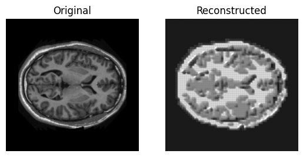
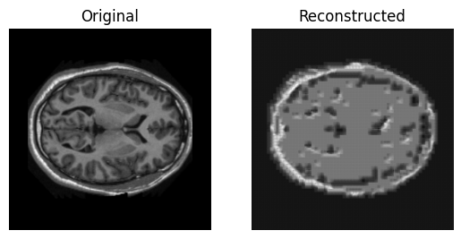

# Generative VQVAE on the OASIS brain dataset

VQ-VAE stands for Vector Quantized Variate Auto-Encoder. This model was first proposed in "Neural Discrete Representation Learning" Aaron van den Oord, Oriol Vinyals, Koray Kavukcuoglu and improves on VAE by discretising the latent space which in turn improves work towards robust optimization. The model samples from the input brain images, which are connected to the encoder layer, of variable size and latent dimension. 


<sup>_VQVAE structure diagram from Neural Discrete Representation Learning_</sup>

Between the encoder and decoder the vector quantization layer simplifies a continuous latent space into a discrete one. It does this by taking a vector from our desired continuous latent space and mapping it to a discrete known vector in the so called codebook. This allows for points in perilous locations of the continuous latent space to be brought to a nearby learned vectors which can then be safely decoded back into the original image. Without this vector quantization the gradient needed for the model to achieve acceptable reconstruction loss would be far more difficult to navigate. 
Without the quantization our latent space is unrestricted and without limitation, harder to learn. 

Once we have this latent space trained with quantized structure we can then decode from any sample we take of the space, and have images which come from these quantized, stable areas, images of low reconstruction loss. 

After the model has trained on our prior images, we can then train the PixelCNN - Pixel Convolutional Neural Network to learn the distribution of encodings from our VQVAE and then use this learnt distribution to generate entirely new images.


## Dependencies

### Tensorflow v2
### Numpy 1.23.3
### Matplotlib 3.5.3

If predict.py gives the error `DNN library is not found` please kill any existing python processes by using the `nvidia-smi` command and then `kill <process_id>`

## Data preparation

The brain image data should have the following file structure within the root of the executing directory. The slices_seg portion of the data is unused. 
```
keras_png_slices_data/
...slices/
......keras_png_slices_train/
.........case_001_slice_0.nii.png
.........case_001_slice_1.nii.png
.........       . . . 
......keras_png_slices_test/
.........case_441_slice_0.nii.png
.........case_441_slice_1.nii.png
.........       . . . 
......keras_png_slices_validate/
.........case_402_slice_0.nii.png
.........case_402_slice_1.nii.png

```

The training / validation split was 70 / 30 to avoid overfitting to the training set.
All images were rescaled to from the range of 0 - 255 to 0 - 1 using a Rescale layer.


## Training





We can see the quality of the reconstruction growing over time.


Here we can see the a number of training metrics converging as the model was trained.

