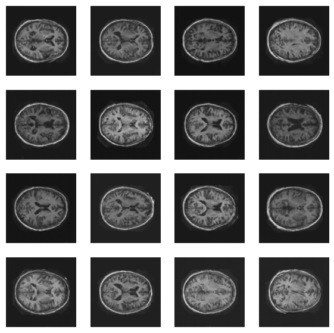
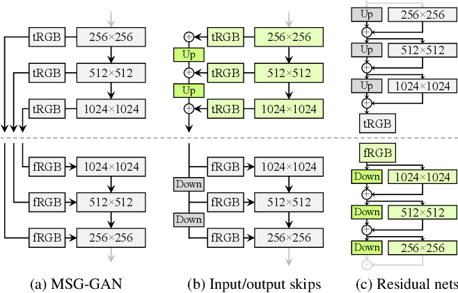
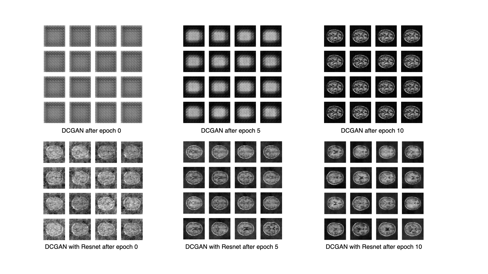
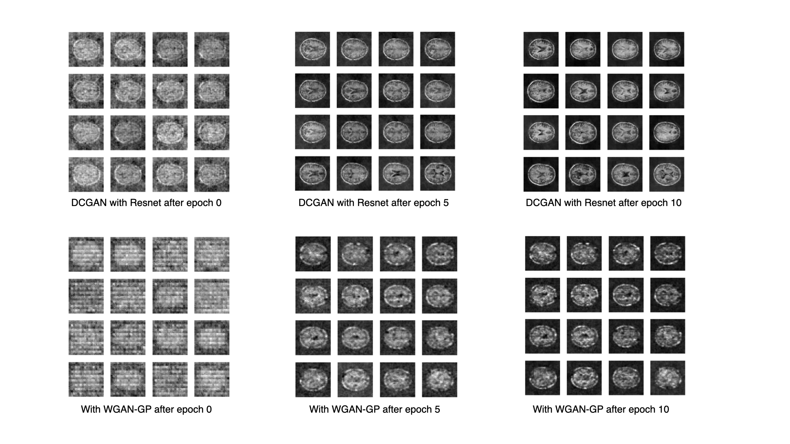
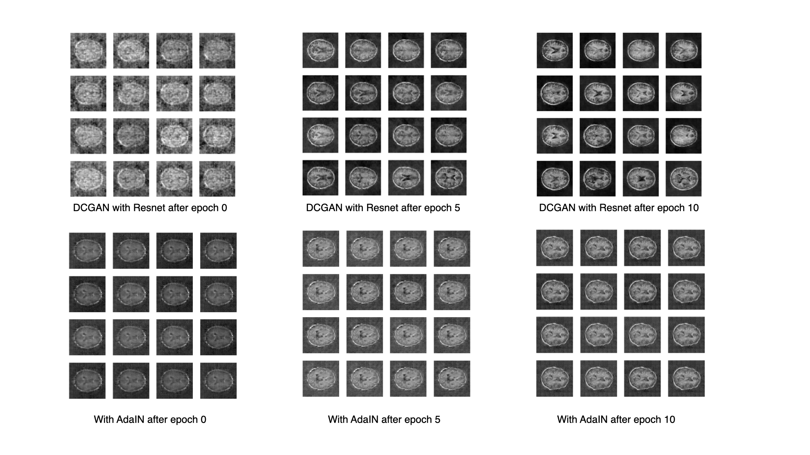

# A Generator Model of the OASIS Brain data Using StyleGAN2

This project implements a simplified version of StyleGAN2 to
generate high resolution synthesized brain MRI images. StyleGAN2 is not
only capable of style mixing, but also proven to improve the quality of 
generated images compared to previous literatures. Because the goal of this
project is to generate high resolution images, style mixing is not 
implemented. Implementation details can be found in 
[this section](#implementation).

The image below is a set of generated images **after only 40 epochs**.
The resolution of each image is 256*256. The total running time was 
3 hours and 1 minute.



## Environment Setup
### Dependencies

- Python 3.8
- tensorflow-gpu 2.6.0
- matplotlib
- numpy
- neptune-client
- neptune-tensorflow-keras

### Install required packages
#### Create a conda virtual environment
```shell
conda env create -f environment.yaml
```
#### General cases
```shell
python setup.py install
```

## Dataset
The dataset used for training and testing is the 
[Preprocessed OASIS dataset](https://cloudstor.aarnet.edu.au/plus/s/tByzSZzvvVh0hZA).
It is a set of brain MRI images of 254*254 resolution. 

Because the generative model does not involve any other testing or validation but
checking the output image qualtiy, no testing or validation split is done on the 
dataset during the training.

## Implementation
A list of tasks to build a StyleGAN from a simple DCGAN is followed during
the implementation as guided by the teaching team of COMP3702. They are introduced
in details under the following sub-sections in the time order of implementation. 
Tasks attempted or implemented are here:

1. A working DCGAN with cross-entropy loss
2. Change the DCGAN structure to the simplified residual architecture in StyleGAN2
3. Change the cross-entropy loss to Wasserstein loss
4. Add latent mapping network and style mixing with either AdaIN or Modulated convolution
5. ~~Path-length regularization~~
6. Gradient penalty
7. Minibatch-standard deviation
8. ~~Style mixing~~

~~Strikethrough tasks~~ have never been attempted.


### DCGAN
The baseline program is the DCGAN built for the demo 2 in COMP3710. It has 
been tested on MNIST and CelebA datasets. The original code was written in 
jupyter notebook, so the code was reformatted for better scalability before 
attempting other tasks on top of it.

### Simplified residual architecture
The image below is an overview of different GAN architectures from the 
StyleGAN2 paper[1]. The structure adopted in StyleGAN2 is the blocks in 
green, which are used to enhance the generated images without progressive 
growing.



The program implemented the identical residual architecture as StyleGAN2.
The generator uses input skips and the discriminator uses residual nets.
After adopting this new architecture to the DCGAN, there is an observable 
leap in the quality of generated images.



Along with the Resnet, the Minibatch-standard deviation is also added to the
output block of the discriminator.

### Wasserstein loss with gradient penalty
After switching to the Resnet, the Wasserstein loss and gradient penalty was 
attempted together, but not adopted eventually. This is due to a degradation 
in image quality after WGAN-GP was implemented. After consulting with the 
tutors at the practical, the program was reverted to use cross-entropy loss.




### Latent mapping with AdaIN or modulated convolution
The latent mapping with AdaIN and modulated convolution has been attempted on
top of the Resnet architecture. The images generated at the beginning of the
training are indeed improved after the mapping network is added, but the model
starts to suffer from complete mode collapse. Unfortunately, both blending 
approaches to mix the disentangled latent and convolution results have this
issue. Therefore, none of them is not added to the program.



### Implementation for limited computing resources
In order to meet the requirement of existing computing infrastructure, 
the structures of generator and discriminator are not exactly the same as the
official implementation of StyleGAN2. 

The original implementation of StyleGAN2 uses a convolutional layer with
a stride of 1 after and before each up-sampling or down-sampling layer to 
smooth the transition between different resolutions. This project keeps
only the up-sampling and down-sampling convolutional layers to keep the 
network small and easier to train.

## Train the Model
The training can be started from the commandline with the following
inputs
```shell
$ python run.py --help
usage: run.py [-h] [--resolution RESOLUTION] [--channels CHANNELS] [--latent LATENT] [--batch BATCH] [--epochs EPOCHS] [--checkpoint CHECKPOINT] [--lr LR] [--beta BETA] [--val VAL]
              [--seed SEED] [-n]
              data_dir output_dir g_input_res g_init_filters d_final_res d_input_filters fade_in_base

Train the generative model to produce high resolution images

positional arguments:
  data_dir              folder of the training data
  output_dir            output folder
  g_input_res           resolution of the first convolutional layer in the generator
  g_init_filters        number of filters of the first convolutional layer in the generator
  d_final_res           output resolution of the last convolutional layer in the discriminator
  d_input_filters       number of filters of the first convolutional layer in the discriminator
  fade_in_base          the divisor of the current epoch number when calculating the fade in factor

optional arguments:
  -h, --help            show this help message and exit
  --resolution RESOLUTION
                        the resolution of the output images, defaults to 64
  --channels CHANNELS   number of channels, defaults to 1
  --latent LATENT       the length of the input latent, defaults to 100
  --batch BATCH         batch size, defaults to 128
  --epochs EPOCHS       number of training epochs, defaults to 20
  --checkpoint CHECKPOINT
                        save frequency in number of epochs, defaults to 1
  --lr LR               learning rate of the optimizers, defaults to 0.0002
  --beta BETA           exponential decay rate for the first moment estimate, defaults to 0.5
  --val VAL             number of validation images
  --seed SEED           random seed
  -n, --neptune         whether to use Neptune to track the training metrics
```

Here is an example to train the model with the following parameters:
 - Output resolution: 256
 - Number of training epochs: 40
 - Batch size: 64
 - Optimizer learning rate: 0.0001
 - Input resolution to generator: 8
 - Initial number of filters in the generator: 512
 - Resolution of the final convolutional layer in discriminator: 8
 - Initial number of filters in the discriminator: 32
 - The divisor of current epoch when calculating the fade-in factor: 80

```shell
DATA_DIR=./keras_png_slices_data/keras_png_slices_train/keras_png_slices_train
OUTPUT_DIR=./Output

python run.py --resolution 256 --epochs 40 --batch 64 --lr 0.0001 $DATA_DIR $OUTPUT_DIR 8 512 8 32 80
```

### Hardware requirements
This project has been tested on a standard_NC6 Microsoft Azure computing instance.
It has
- 6 vCPUs
- 56GB memory
- 340GB SSD
- 1 NVIDIA Tesla K80 GPU with 12GB dedicated memory

The program has a minimum GPU memory requirement of 10GB for training
with an image resolution no more than 256*256. Otherwise, the training
will crash with a resource exhausted error.

### Recommanded values for training hyper-parameters

|resolution| epochs | fade_in_base | batch | lr |
|----------|--------|--------------|--------------|---------------|
| 256 | 40 | 80 | 64 | 0.0001 |
| 128 | 30 | 40 | 64 | 0.0002 |
| 64  | 30 | 40 | 128 | 0.0002 |


## Reference
[1] Karras, T., Laine, S., Aittala, M., Hellsten, J., Lehtinen, J. and Aila, T., 2020. Analyzing and improving the image quality of stylegan. In Proceedings of the IEEE/CVF Conference on Computer Vision and Pattern Recognition (pp. 8110-8119).

[2] Karras, T., Aila, T., Laine, S. and Lehtinen, J., 2017. Progressive growing of gans for improved quality, stability, and variation. arXiv preprint arXiv:1710.10196.
