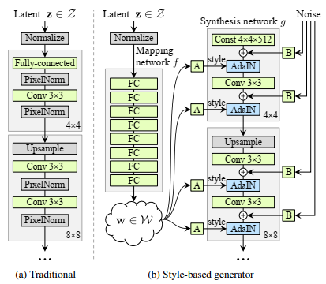

## StyleGAN in Pytorch    
This report follows the implementation of [rosinality](https://github.com/rosinality/style-based-gan-pytorch), thanks for rosinality's wonderful and detailed works. It helps me understand a lot of details of StyleGAN.  
[A Style-Based Generator Architecture for Generative Adversarial Networks](https://arxiv.org/abs/1812.04948)  
[Progressive Growing of GANs for Improved Quality, Stability, and Variation](https://arxiv.org/abs/1710.10196)  
[Improved Training of Wasserstein GANs](https://arxiv.org/abs/1704.00028)  
### Introduction to StyleGAN  
  
StyleGAN focuses on modifying the generator, the discriminator used is almost the same with Progressive GAN.  
#### B Bilinear Interpolation
Based on Progressive GAN, StyleGAN uses bilinear interpolation in both generator and discriminator instead of the nearest interpolation. In implementation, a combination of bilinear interpolation and deconvolution is used in generator, a combination of bilinear interpolation and convolution is used in discriminator. By these combinations, StyleGAN can be faster and more memory-efficient.  
#### C Mapping Network