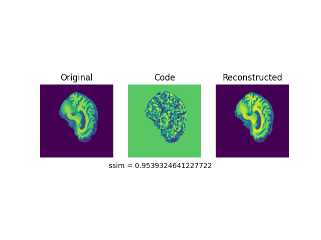

# VQVAE on ADNI dataset to generate new brain samples

**Description of algortihm and problem it solves 1 paragraph**

With this project we wanting generate new samples of brain images using VQVAE to create discrete latent codebooks for which we will then feed into a PixelCNN model to create the new images. We will use the ADNI dataset to train the VQVAE model to successfully encode and decode images with at least >0.6 SSIM. The model uses Vector-Quantisation (VQ) layer to learn the embedding space with L2-norm distances. Then we feed the resulting codebooks to train a PixelCNN model to generate new codebooks which will hopefully decode into new brains. It achieves this by taking the probability distribution of prior examples to learn the probability distribution of new samples. The output of this is used as a probability distribution from which new pixel values will be sampled to generate the desired image.

The graph below shows the total, VQ loss and reconstruction loss. We observe that we get really great results within 2 epochs. That is high SSIM, but then this drops off in the next epoch but rises again to over 0.9 average SSIM by 20 epochs. The losses are as expected decreasing quickly in the beginning as the model learns the weights and improves only a little as we increase in epochs.

Below are 2 examples of the results of the VQVAE model (see results section for more examples) 

 <strong>30 epochs</strong> 

 <strong>50 epochs</strong> 

We observe that we obtain really great results in generating the codebooks and also decoding the codebook data back to the original result while retaining almost all details. We also obtain great SSIM scores which suggests that our model is great at encoding and decoding images while keeping the result similar to the original. We also notice that we only achieve marginal improvements in reconstruction similarity with more epochs.

**figure and visualisations**

**dependencies versions and reproducibility of results**

**example inputs outputs and plots of algorithm**

**pre-processing with references justify train,validate and test splits**

encoder gives discrete codes rather than conts, priors are learnt rather than being static

latent vector is hidden

encoder outputs means and log(stds) 

minimise recons loss

q(z|x)

miinimise the posterior given the prior

regularising latent space

find closest L2 norm codebook

discrete latent codebook vectors that are learnable, decoder we take out the 

forward propagate is standard, back propagate, gradients from decoder to encoder then encoder knows how to change information to lower recons loss 

encoder optimises both first and last loss terms, 

training vqvae prior is kept constant and uniform and then we fit autoregressive distribution to generate x using ancestral sampling