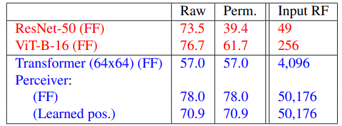
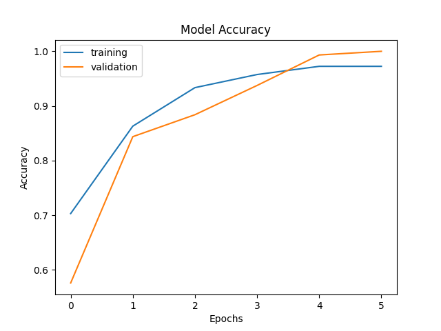
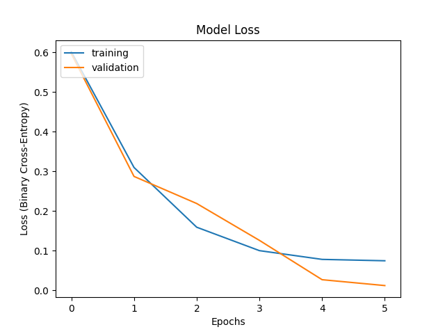
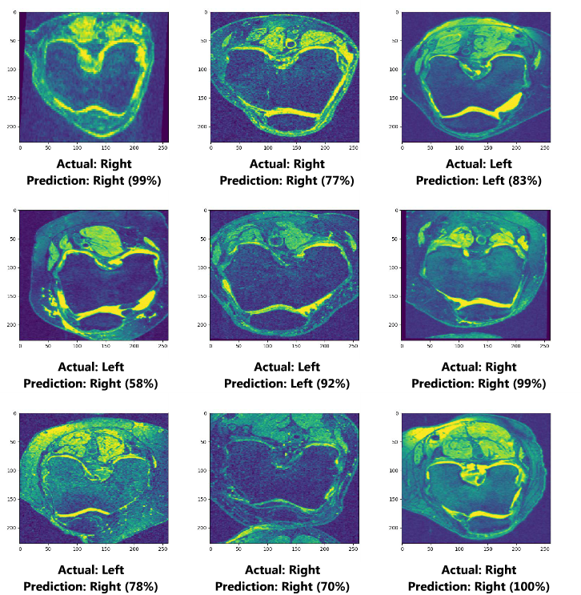

# Perceiver Model for Knee Laterality Classification (OAI AOKA Knee MRI Dataset)

The perceiver is a new model that aims to use transformers for classifcation of data of any modality. This may be a viable method for classifying the laterality of knees (left or right) which may help in automated sorting of data for medical purposes. The dataset is OI AOKA Knee MRI Dataset and contains 18680 images of 427 patients. The Perceiver model successfully classified test set knee data with an accuracy of 91%.

## Perceiver

The perceiver is a model recently released by Google Deepmind, that uses less architectural assumptions about the modality of data to increase flexibility of networks while still providing high performance (Jaegle et al., 2021). In fact, it is competitive with state-of-the-art classification techniques that assume a grid structure for image processing. It solves the computational complexity problem of self-attention mechanisms, and instead uses a query-key-value cross-attention module where the query or latent array is significantly smaller than the incoming data. This enables the perceiver to have many more iterations of transformers and attention modules efficiently. Positional information lost from reducing the data into a byte array is re-added through a fourier positional encoding (or can be learnt with lower performance). 

*Figure 1: Perceiver conceptual architecture.*

*Figure 2: Perceiver accuracy competitive on ImageNET with Fourier Features (FF).*

## Dataset (OAI AOKA) pre-processing

The data was pre-processed from the COMP3710 blackboard already. However, this was just a directory of images. The data was sorted based on which patient it belonged to, so a train/test set would not have leakage between patients. Patients and the laterality of knees are determined based on the string in the file names. The data is then shuffled. The data contains 7760 left knees and 10920 right knees. The same image resolution size was kept (228, 260) with a single channel as it only requires greyscale.

*Figure 3: Example left knee image from OAI AOKA.*

## Perceiver Architecture & Hyperparameters

Latent array size: 64

Learning rate decay: Same as Perceiver paper (10 fold decrease at 3 epoch checkpoints)

Optimizer: LAMB

### Fourier Positional Encoding
A fourier encoding was used to add positional information to the inputs. This follows the technique from the original paper. 4 bands were used, with a maximum sampling frequency (Nyquist) of 10. This was done over the two dimensions in every image. 
Fourier Encoding partially from https://github.com/Rishit-dagli/Perceiver 

### Cross-Attention Module
The cross-attention module computes cross attention using query/key/value networks. The output is then concatenated with a new latent array generated from the attention output using two dense layers. Each network has layer normalization applied. The initial latent array used for querying it initialized using the truncation operator from the perceiver paper.

### Transformer Module
The transformer module uses 4 transformers for each cross-attention, and 4 transformer heads. The output of the transformer is concatentated with a new query, generated from the transformer output using two dense layers. Each network has layer normalization applied.

### Classifier
The clasifier head consists of a global average pooling layer which takes in the processed transformer output, which is then classified with a dense layer and sigmoid activation function using binary crossentropy loss. 

## Results

91% on test set (1000 images). Training: 2000 images, validation: 450 images.

*Figure 4: Perceiver accuracy for training and validation sets.*

*Figure 5: Perceiver loss for training and validation sets.*

*Figure 6: Predictions from the test set. Some are difficult to tell even for a human.*

*Figure 7: Training and test set evaluation.*

## Dependencies
- Python 3.7
- TensorFlow 2.6.0
- Pillow 8.3.1
- numpy 1.19.5
- OAI AOKA Knee Dataset

## References

Jaegle, A., Gimeno, F., Brock, A., Zisserman, A., Vinyals, O., Carreira, J. (2021). *Perceiver: General Perception with Iterative Attention* Retrieved from: https://arxiv.org/pdf/2103.03206.pdf.