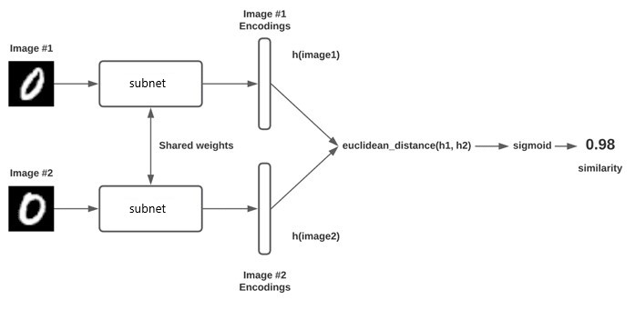
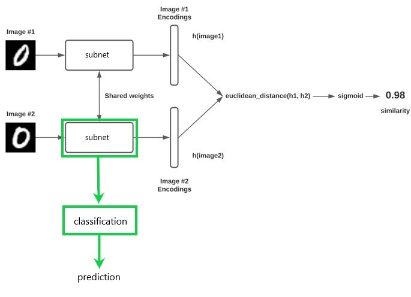
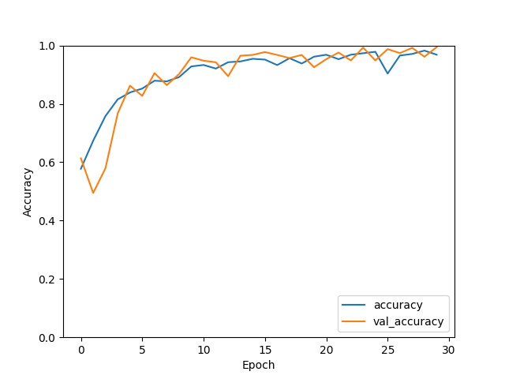
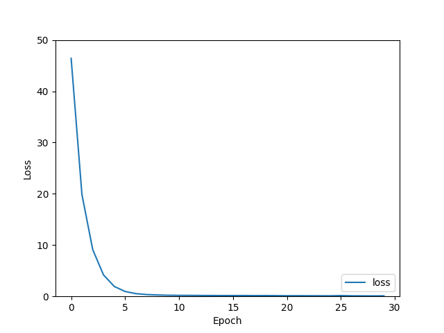
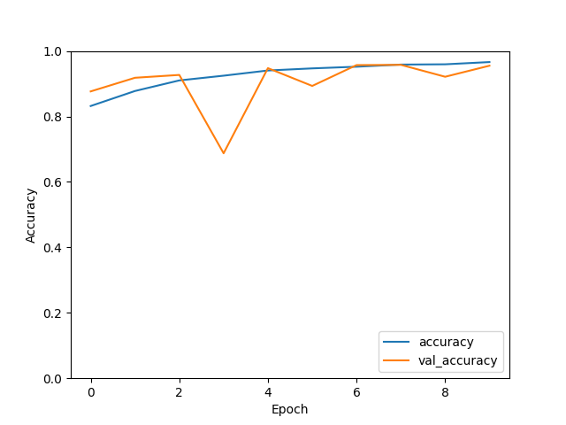
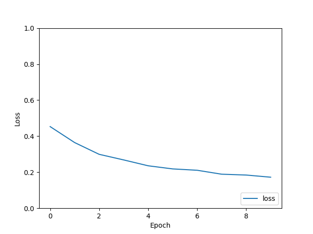

# **Using a Siamese Neural Network to detect Alzheimer's Disease in brain scans**
# Siamese Neural Networks
## Model

A Saimese Neural Network is a form of a twin network, consisting of two identical subnetworks. The networks have the same configurations, parameters and weights, hence identical. A pair of images is passed through each network, thus computing the features of each image. The similarity is then computed by passing the feature pairs through a euclidean distance function. The aim of the network is to produce a value such that we know if the images are different or the same, with 0 for different, 1 for same.

## Loss Function

Due to the nature of SNN's, cross entropy functions do not work. Given this there are other types of loss functions used with SNN's. Mainly there are two types that are most commonly used.

### Triplet Loss

Triplet Loss works by using three input values, an anchor value, positive value, and negative value. The anchor is a baseline value, and the positive value is of the same class as the anchor, whilst the negative is of a different class. The anchor is compared to the positive and negative values, and the loss function minimises the distance from positive values, and maximises differences to negative values.

### Constrastive Loss

Contrastive loss simply takes two inputs and computes the euclidean distance between the image features. Points with similar features will have a low euclidean distance, and high euclidean distance for points with dissimilar features.

# Using an SNN to classify Azlheimer's Disease
In this report we are attempting to classify the presence of Alzheimer's disease through the inspection of a brain scan.

It is possible to classify a brain scan as either Alzheimer's Disease (AD) or Cognitive Normal (CN) through the use of an SNN. To do this we need a dataset of image pairs to train the model. The pairs will be either two CN’s or a CN and an AD, and have a corresponding label (0 for two CN’s, 1 for combination). After training the model, given a pair of image, the model can then either classify the pairs as either two CN’s or a combination of an CN and an AD. 

At this point we can only tell if two images are CN or a combination of CN and AD. However we want to have a model that we can pass a singular scan into, and know whether the scan has AD or is a CN. To accomplish this we take the trained subnetwork, and re train the subnetwork with a classifier. Once trained this model is capable of classifying a brain scan.

# Data
## SNN Data
The data used to train this model is the ADNI dataset. The dataset consists of a training set, containing ~10000 images of cognitive normal brain scans (or normal controls) and ~10000 images of brain scans of patients with Alzheimer's disease. The test set contains ~4500 of each type. In order to train the SNN, the train data is split into 80% for training, and 20% for validation. However the data in its raw form is not suitable for training an SNN, as we need image pairs and labels. Therefore we must build the image pairs when loading the data. This is done in [dataset.py](./dataset.py), and is well documented in the code. In short we take all the image paths, create the pairs and labels corresponding to the pair, turn them into tensorflow datasets, and then shuffle the dataset before splitting into 80% train, 20% validation. No test set is generated from the image pairs, as we only test the final classification model. Further given the large amount of data, 20% is a suitable amount of data to validate on.
### Example Pair (AD | CN)

 

Label:  
1 as it is a pair of different classifications

## Classification Data
To test and train the classification model we must build a new dataset. One that just contains singular images, and a corresponding label for whether the image is AD or CN (0 or 1). We again use a 80/20 train validation split, and use the entire test set to evaluate the model after training.
### Example Input (AD)

Label:  
0 as it is an AD image

# Model Architecture
## SNN

The architecture of the Siamese Neural Network presented in this report follows a general SNN architecture. There is a subnetwork, a euclidean distance layer, and then a classification layer. However the choice of subnetwork design is the critical part of an SNN. Due to the large effect the subnetwork design has on the output of the model, I experimented with two different subnetwork designs before settling on the final architecture. ResNet50 was initially used for the subnetwork, but this produced underwhelming results both when evaluating the SNN and the classification model. However, during research I encountered the following paper, [Using Deep Siamese Neural Networks for Detection of Brain Asymmetries Associated with Alzheimer’s Disease and Mild Cognitive Impairment](https://www.ncbi.nlm.nih.gov/pmc/articles/PMC6874905/), which was attempting to use an SNN to detect brain asymmetries. Though this is not the exact problem being solved, the data is relatively similar, i.e single colour channel brain scans. In the above referenced paper they used a 6 layer fully connected network. Using what was learnt from that paper a 6 layer fully connected neural network was used for the subnetwork, producing significantly better results. Each layer uses L2 kernel regularization to avoid over/under fitting the model. Each layer also uses ReLu activation. 
    # height = 128 and width = 128 for ADNI data
    subnet = k.Sequential(layers=[
            kl.Flatten(input_shape=(height, width, 1)),
            kl.Dense(1024, activation='relu',kernel_regularizer='l2'),
            kl.Dense(1024, activation='relu',kernel_regularizer='l2'),
            kl.Dense(1024, activation='relu',kernel_regularizer='l2'),
            kl.Dense(1024, activation='relu',kernel_regularizer='l2'),
            kl.Dense(1024, activation='relu',kernel_regularizer='l2'),
            kl.Dense(1024, activation='relu',kernel_regularizer='l2'),
        ], name='subnet'
    )

The Euclidian Distance layer is a custom layer, created with the following function:

    def distance_layer(im1_feature, im2_feature):
        tensor = kb.sum(kb.square(im1_feature - im2_feature), axis=1, keepdims=True)
        return kb.sqrt(kb.maximum(tensor, kb.epsilon())) 

The loss function chosen was the contrastive loss function (chosen as this was also used in the referenced paper). Code was sourced from [Image similarity estimation using a Siamese Network with a contrastive loss](https://keras.io/examples/vision/siamese_contrastive/):

    def contrastive_loss(y, y_pred):
        square = tf.math.square(y_pred)
        margin = tf.math.square(tf.math.maximum(1 - (y_pred), 0))
        return tf.math.reduce_mean((1 - y) * square + (y) * margin)

Lastly the Adam optimizer with a learning rate of 0.0001 was used.  

## Classification

The classification takes the trained subnet model from the SNN, and retrains the model using a classification layer

    image = kl.Input((128, 128, 1))
    tensor = subnet(image)
    tensor = kl.BatchNormalization()(tensor)
    out = kl.Dense(units = 1, activation='sigmoid')(tensor)

This model is trained using the adam optimiser with a 0.0001 learning rate. Given we are doing binary classification (0 or 1), binary cross entropy loss function is used

# Results
## SNN

  

The snn was trained over 30 epochs, though it should be noted high accuracy in detecting similar/dissimilar images was apparent at around the 10th epoch. The loss saw a rapid decrease at the beginning of the training. The general shape of the loss curve indicates the model successfully improved at comparing images over the training cycle.

## Classification

The training of the classification model did not have the same success as the siamese model. However given the main layer of this model, the subnet, was pre trained from the SNN, the model saw high validation accuracy from the beginning. Unfortunately it did not improve all too much over the training, only improving by a small percentage. Note in the run shown in this report the model appeared to have high validation at the beginning, but the dip at the 3rd epoch is more representative of the validation accuracy early in training. 10 epochs were used as this consistently saw the models validation accuracy stablilise around 90%. The loss curve again indicated successful training, however due to the subnet being pre trained the loss started fairly low. I suspect if I had trained the subnet less, say < 10 epochs, we would say a higher loss at the beginning of the classifier training

# Dependencies
## Python Packages

This project will require you have the following python packages:

- TensorFlow  
- Keras  
- Matplotlib  

## CUDA/cudNN

Though it is possible to train this model without a proper GPU, it is recommended you do so. The following [guide](https://developer.nvidia.com/cudnn) will go over the setup of cudNN to allow tensorflow to utilise your GPU.

## Data

The [ADNI MRI dataset](https://cloudstor.aarnet.edu.au/plus/s/L6bbssKhUoUdTSI) is required to train and test this model. Once downloaded update the DATA_PATH global variable in [dataset.py](./dataset.py) to point to the location of the ADNI_AD_NC_2D folder. The processing of the data is done within this project, so once downloaded no preprocessing is required.

# References

The following were used for both learning about SNN's, but also to get a better understanding of how to apply an SNN to the particular problem. 
1. [Keras.io Siamese Network](https://keras.io/examples/vision/siamese_network/)  
1. [Image similarity estimation using a Siamese Network with a contrastive loss](https://keras.io/examples/vision/siamese_contrastive/)
1. [Siamese Neural Networks for One-shot Image Recognition](https://www.cs.cmu.edu/~rsalakhu/papers/oneshot1.pdf)  
1. [Using Deep Siamese Neural Networks for Detection of Brain Asymmetries Associated with Alzheimer’s Disease and Mild Cognitive Impairment](https://www.ncbi.nlm.nih.gov/pmc/articles/PMC6874905/)
1. [A friendly introduction to Siamese Networks](https://towardsdatascience.com/a-friendly-introduction-to-siamese-networks-85ab17522942)