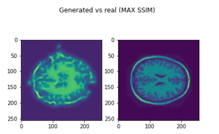

# Generative Model using VQ-VAE + DCGAN

## Usage
#### Dependencies:
- torch==1.9.0
- torchvision==0.10.0
- matplotlib==3.4.3
- Numpy==1.19.5
- tqdm==4.62.1
- Pillow==8.4.0
- skimage==0.18.0

To reproduce results using any dataset. Prepare dataset by structureing the data directory in accordance with torchvision.datasets.ImageFolder (https://pytorch.org/vision/stable/datasets.html). Modify data dir path in driver.ipynb and run all cells in order.

Results may be volatile and vary with iterations. I recommend performing multiple runs of the notebook and selecting the best model. Due to the current limitations of the implementation, it is recommended to train the VQ-VAE for at most two epochs ergo restricting the number of unique q(z|x) values preferably to 2.

# Model and Training Overview
#### VQ-VAE 
Variational autoencoder (VQVAE) is a VAE network where the encoder network outputs discrete, rather than continuous, codes [1]. We use vector quantisation to learn a codebook (embedding space).

In the model, each vector of the encoded image maps to the closest vector in the learned embedding space (codebook), where the closeness is defined by the L2 norm distance. The embedding is represented as codebook indices q(z|x) which when decoded reconstructs the original image.

The models used for encoder and decoder are as defined in Experiment 4.2 [1].

Once the embedding space (codebook) is trained on images we use a DC-GAN to generate a image representation of codebook indices. These generated images are mapped to discrete codebook indice values by splling them evenly in intervals depending on number of unique discrete values in codebook indices (q(z|x)) during training.
From observations greater the number of epochs trained greater is the number of unique q(z|x) elements. 

I use the DCGAN as defined in [2] where the generator is defined as 

All models are defined in PyTorch in the models module:
- `models.residualBlock`  Residual block implementation, used in encoder and decoder. 
- `models.decoder`  Decoder implementation.
- `models.encoder` Encoder implementation.
- `models.vector_quantizer` Implementation of vector quantiser used in training codebook.
- `models.vqvae` vqvae model.
- `models.generator` Generator used in DCGAN.
- `models.discriminator` Discriminator used in DCGAN.

# Results on OASIS brain dataset
The VQVAE was trained only for two epochs to minimise unique q(z|x) values. (2 in the best case) Followed by training the DCGAN. *Intermediate results from steps and training parameters can be viewed in `driver.ipynb`*.

SSIM was >0.60 in 7809 out of 10000 training images used. Best SSIM archived was 0.698\

# Scope for improvement
The main drawback of the current implementation is the limitation of mapping GAN generated codebook indices to discrete codebook indices learned by the decoder. Current implementation performs best when the number of discrete elements is small. Possible improvements to increase accuracy and allow training the VQVAE for higher epochs:
- Optimise mapping algorithm: The current mapping relies on uniformly diving the output in intervals of the same size. Can be improved and optimized by training the bin sizes to improve mapping accuracy.
- Modify the DCGAN to output multichannel one hot encoded codebook indices rather than an image representation.

# References
[1] van den Oord, A., Vinyals, O., & Kavukcuoglu, K. (2017). Neural Discrete Representation Learning. CoRR, abs/1711.00937. Opgehaal van http://arxiv.org/abs/1711.00937

[2] Alec Radford, Luke Metz, & Soumith Chintala. (2016). Unsupervised Representation Learning with Deep Convolutional Generative Adversarial Networks.
