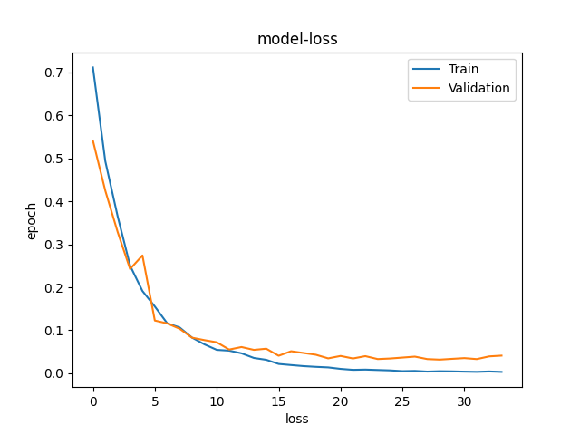
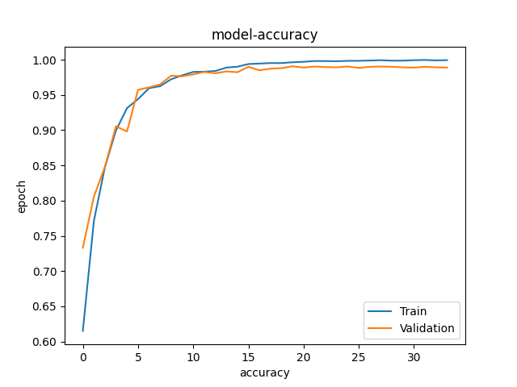
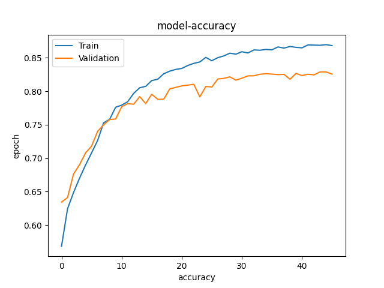

# OAI AKOA Perveiver Transformer

The perceiver mixes the latent self-attention mechanism with the cross-attention
mechanism. The input data only enters through the transformer through the 
cross-attention mechanism. This allows the model to be of significant lower 
size than the data array and solves the transformer quadratic compute bottleneck. 

The perceiver transformer works for inputs such as images, videos, and
audio. No prior assumption or changes is required for any input modality, 
for the model to work. 

Given an image, it will do transformer like attention but since images are of 
large shape it is too much to put it in one transformer. Therefore, it 
sub-divides the image into patches, and for each patch, it makes a vector out 
of it. All the pixels are close together goes into one vector, thus treated as 
a group.

 

## Results

Patches : 40

### Without Augmentation

####Test accuracy: 98.77%

### With Augmentation

####Test Accuracy: 83.06%

