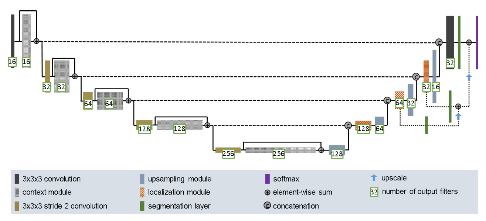
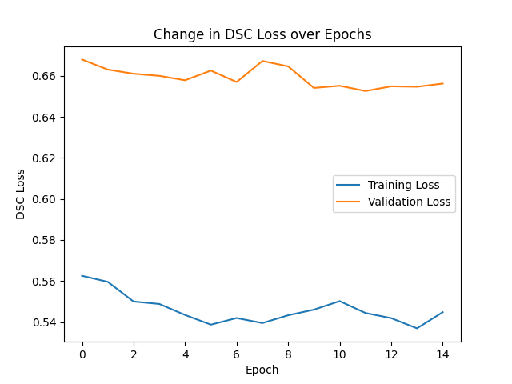
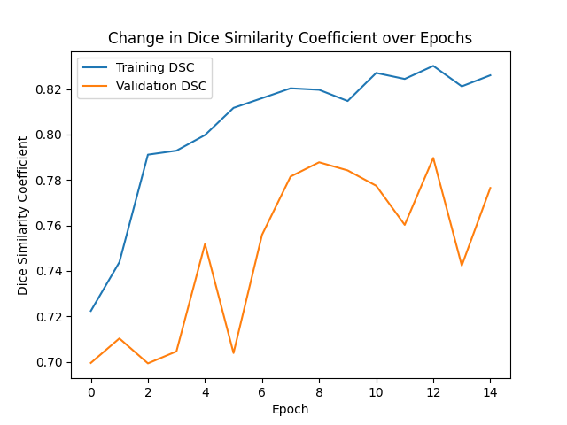
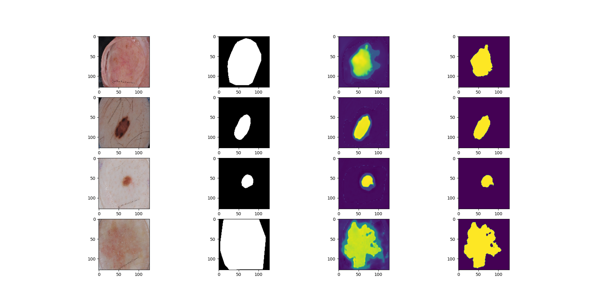

# Skin Lesion Segmentation on the ISIC Challenge 2017 Dataset Using Improved U-NET

**Avatar Azka - 47286238**

Submission for the final report in the course COMP3710 (Pattern Recognition & Analysis)

## Project Files
- `modules.py`: Contains the pyTorch implementation of the Improved U-NET network.
- `train.py`: Program to train and save the Improved U-NET model, along with the loss and metrics histories.
- `predict.py`: Utilizes the model generated by `train.py` to measure its performance against the test set, and generate several segmentations on the set.
- `plot.py` Helper module to plot loss and metric histories saved after training execution.

## Algorithm Overview

The Improved UNET network, as detailed in the paper by Isensee et al. (2018) [1], is split into a context pathway and a localization pathway. The context pathway performs feature extraction, the result of which is then taken as the input for the localization pathway which, as the name suggests, aims to localize particular areas of interest. Both pathways are connected to each other via skip connections, which allows the network to recover finer details to be included in the final output mask. Beyond the diagram, Improved UNET utilizes dropout layers between convolutions in each context module. It also uses instance normalization in place of batch normalization, which the author owes to its small batch sizes destabilizing batch normalization.

This algorithm aims to utilize the Improved UNET network to segment areas of lesions on skin. The network will take an RGB image of skin with lesions on it, and output a mask detailing what region the lesion occupies.

### How It Works
As the input passes forward through the network, what results are images of a similar shape as its input. To generate a mask from this output image, the implemented algorithm isolates the first RGB channel of the image, then sets whatever elements are of a value greater than or equal to a given threshold value (in this case, 0.5) to 1.0, and whatever is lower than that is set to 0.0. This resulting mask can then be compared with the ground truth of the data. From this the loss can be calculated, and have its result backpropagated along the network via chain rule in order to tune the weights of the layers.

### Loss and Metrics
The performance of this model was measured using the Sørensen–Dice coefficient [2]. The loss function is directly derived from this statistic, being 1 - the Dice coefficient. It should be noted that the dice coefficient calculated for the loss function is derived from the isolated channel of the output image itself, and not the mask derived from it. This is done to ensure the possibility for backpropagation. As such, the Dice coefficients displayed in the loss function and the DSC metric itself may show some discrepancies, though in effect this does not affect the performance of the model.

### Dataset 
#### Folder Structure
The dataset module itself is structure-agnostic, though train.py and predict.py expect a folder structure as detailed below in order to access the dataset:
```
data/
├─ test/
│  ├─ data/
│  ├─ truth/
├─ training/
│  ├─ data
│  ├─ truth
├─ validation/
│  ├─ data
│  ├─ truth
```
Where the subfolders labeled data contain the images to be input into the network, along with the dataset metadata csv file; the subfolders labeled truth contain the ground truth masks corresponding to the images in data.

### Preparation
This algorithm operates on the ISIC Challenge 2017 Dataset. Each element of the dataset, upon retrieval by the data loader, is resized to become 128x128 to reduce memory consumption and training time. Each image is read as an RGB image and has their RGB values normalized (elementwise division by 255) such that they fall between 0 and 1.

### Train-Test-Validation Split
When training the model, the algorithm loads 800 training elements (i.e. image-mask pairs) at a time, though it shuffles the loader per epoch, effectively covering the majority of if not entire training set (2000 elements) over a total of epochs. Due to time and resource constraints, only 100 of the 150 total elements of the validation set are used to measure the validation metrics during training. In measuring the model's performance against the test set, the entire test set of 600 image-mask pairs is used.

## Results
### Training
After 15 epochs, the following plot of losses and dice similarity coefficients of both training and validation datasets were achieved:




By the end of training, the model achieved an average DSC of 0.83 over the training set, and 0.78 over the validation set.

The model was then saved and its performance over the test set was measured. In the end the model resulted in having a loss of 0.54 and a Dice Similarity Coefficient of 0.79.


The resulting masks can be seen in the figure below:



Here, the first column represents the image which the network takes as its input. The second column shows the ground truth mask of the image. The third column shows the isolated channel output of the network, and the final column shows the resulting mask, where values above the threshold of 0.5 are set to 1.0, and those below are set to 0.0.


## Prerequisites

### Dependencies
```
matplotlib == 3.6.1
numpy == 1.23.4
pandas == 1.5.1
torch == 1.12.1
torchvision == 0.13.1
cudatoolkit == 11.3.1
```

## Reproducibility of Results
Due to the shuffling of the dataset during training, it cannot be guaranteed that the resulting model after training can be exactly reproduced over multiple iterations.

## Notes
### On Hyperparameters
The current hyperparameters are, admittedly, suboptimal. However, due to resource and time constraints, the batch size is set to 1 as going any higher leads to out-of-memory errors on my machine. This has been tested on the Rangpur compute system, and it seems to be able to tolerate higher batch sizes of at least 10, though execution times were faster locally.


## References
1. [Isensee et al. (2018)](https://arxiv.org/abs/1802.10508v1)
2. [Wikipedia: Sørensen–Dice coefficient](https://en.wikipedia.org/wiki/S%C3%B8rensen%E2%80%93Dice_coefficient)
