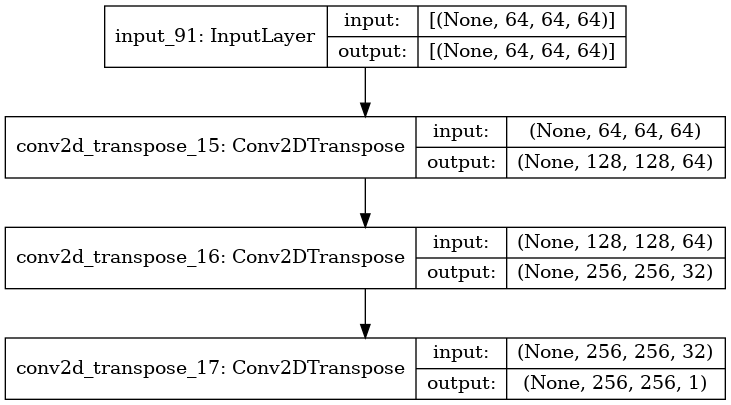
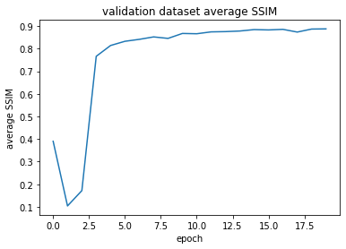
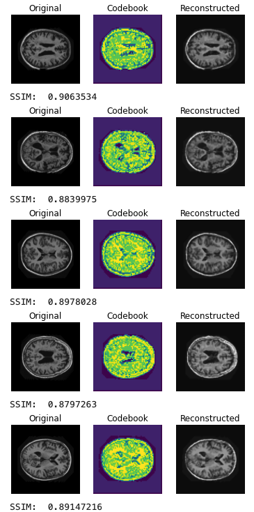
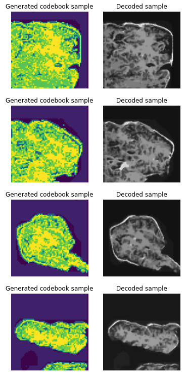

# VQ-VAE for the OASIS MRI image dataset

This project creates a generative model of the OASIS brain image dataset using a VQ-VAE (Vector Quantised-Variational AutoEncoder) model, and a PixelCNN prior.

## Background on OASIS dataset

The [OASIS dataset](image_dataset_from_directory) is a set of ~9000 MRI image slices of brains. A download can be found on the course (COMP3710) Blackboard.
## Background on VQ-VAE/PixelCNN

An autoencoder is a neural network which learns efficient latent representations of unlabelled data.

VQ-VAE[1] is a special autoencoder model where the latent space consists of discrete vector embeddings.

It is initially trained using a uniform prior for the embedding vectors. However, after the autoencoder is trained, a prior distribution for the codebook can be learnt using PixelCNN[2]. PixelCNN creates an autoregressive model of the pixels in the codebooks for the encoded images in the dataset, which then allows for sampling from the distribution it learns. This allows the creation of a generative model for the OASIS dataset.

More information can be found in the original papers referenced as [1] and [2] in the references section.

## About this implementation

### Data pipeline

The images are loaded from disk using Keras' `image_dataset_from_directory` utility, which allows the creation of a memory-efficient batched data pipeline to input into the model.

Prior to training, the pixels (originally in [0,255]) were scaled down, to [0,1] and then shifted to [-0.5, 0.5], which was found to give the best results.

Since this model is fully unsupervised, there was no test dataset. However, a custom metric that calculates the average structural similarity [SSIM](https://en.wikipedia.org/wiki/Structural_similarity) after each epoch was applied to the validation dataset to help ensure there was no unexpected overfitting.
### Encoder and decoder networks

Only simple encoder and decoder CNNs with a few convolutional layers to needed to generate good results (at least on the SSIM metric). An example Keras visualisation of the encoder network (with latent dimension D=64 in this example) is below:

And the corresponding decoder:

## Results

### VQ-VAE
The following results were found using the default parameters defined in the driver script.

In the following plot, we can can see by the end of training, the [SSIM](https://www.tensorflow.org/api_docs/python/tf/image/ssim) values computed using `tf.image.ssim` are very high (far beyond 0.6) after a few epochs:

We can also see some visualisations of the codebook for some example images, and then reconstructions of those images below:

### PixelCNN samples

After training the PixelCNN on the codeboooks for the dataset after training the VQ-VAE, I generated a few samples to test it out.

Unfortunately I have so far not been able to generate perfect brains (they currently look closer to tadpoles if I am honest).

I am sure some many more hours of tinkering with hyperparameters and training will get a better result (and feel free to try!).

## Running the model yourself

### File layout

The code is in three main files:

- `vqvae.py`, which contains the model definitions for the VQ-VAE.
- `pixelcnn.py` which contains the model definitions for the PixelCNN.
- `driver.py`, which contains scripts to load the OASIS dataset, and train the models defined above.

### Dependencies

Apart from `python3`, the dependencies needed to train and visualise the model are:

- `tensorflow`
- `tensorflow-probability` (for the driver script)
- `numpy` (for the driver script)
- `matplotlib` (for the driver script)

at the most up to date versions. These are also listed in `requirements.txt`, and can be installed using the handy command:

> pip install -r requirements.txt

### Running the driver locally

1. Ensure all packages are installed (i.e. by using `pip install -r requirements.txt`)
2. Download OASIS MRI dataset (`keras_png_slices_data.zip`) from Blackboard.
3. Unzip the downloaded OASIS files into this folder. In this folder, there should then be (at least) the two sub-folders, `keras_png_slices_data/keras_png_slices_test` and `keras_png_slices_data/keras_png_slices_validate` accessible, with the unzipped images inside them.
4. Run `python driver.py` in this folder.

### Changing parameters

Running `python driver.py -h` will give access to a list of options that allow you to tweak all the parameters used in training.

> usage: driver.py [-h] [--data DATA] [--K K] [--D D] [--beta BETA] [--epochs EPOCHS] [--batch_size BATCH_SIZE]
                 [--learning_rate LEARNING_RATE] [--shift SHIFT] [--pcnn-epochs PCNN_EPOCHS]
                 [--pcnn-learning-rate PCNN_LEARNING_RATE] [--pcnn-filters PCNN_FILTERS]
                 [--pcnn-res-blocks PCNN_RES_BLOCKS] [--pcnn-layers PCNN_LAYERS]
> 
> ...

## References

1. [Neural Discrete Representation Learning, by van den Oord, et. al. (2018)](https://arxiv.org/pdf/1711.00937.pdf)

2. [Conditional Image Generation with PixelCNN Decoders, by van den Oord, et. al. (2016)](https://arxiv.org/abs/1606.05328)

3. [VQ-VAE in Keras](https://keras.io/examples/generative/vq_vae/)

4. [PixelCNN in Keras](https://keras.io/examples/generative/pixelcnn/)

