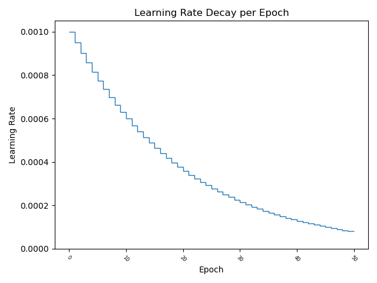
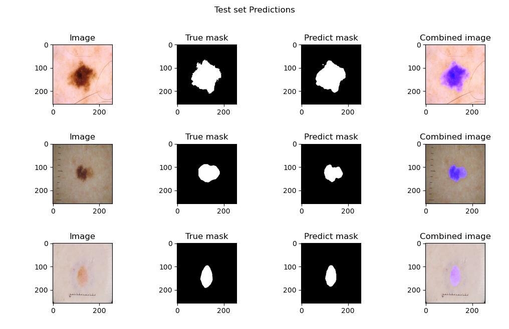
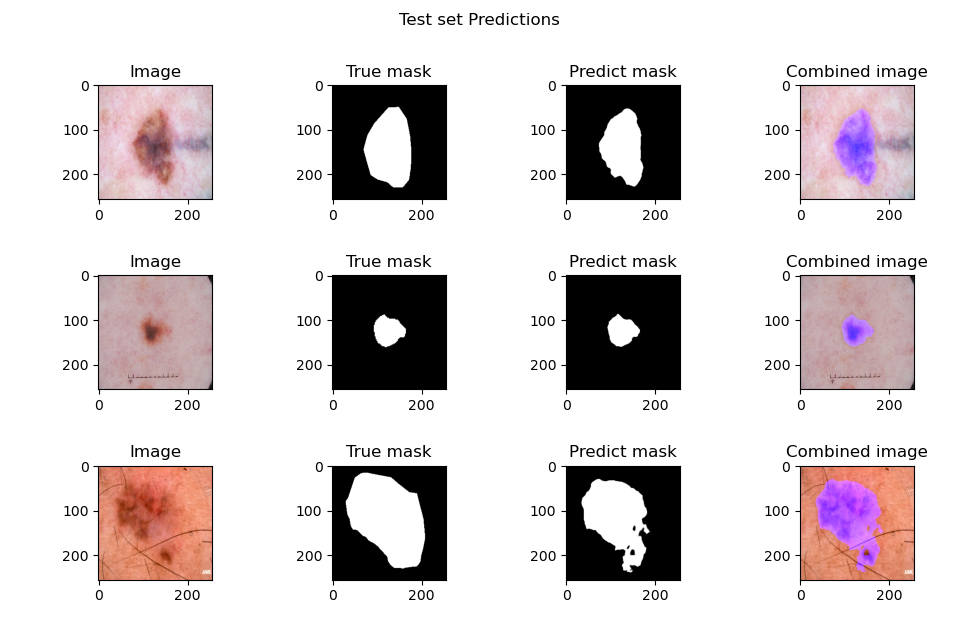
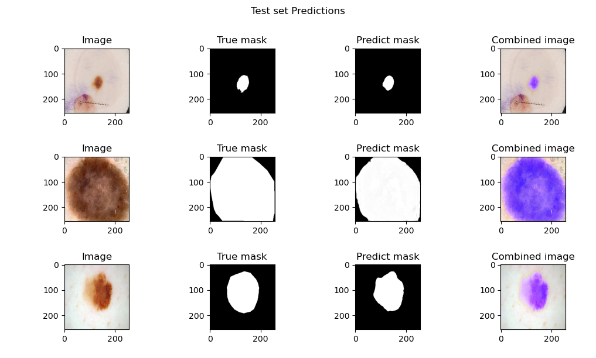

# ISICs Dataset Segmentation with Improved UNet

## Author
**Name:** Jeng-Chung, Lien<br/>
**Student ID:** 46232050<br/>
**Email:** jengchung.lien@uqconnect.edu.au

## Table of Contents
* [Introduction](#introduction)
* [ISICs Dataset](#isics-dataset)
    * [Data preprocessing](#data-preprocessing)
* [Improved UNet Model](#improved-unet-model)
* [Training Model](#training-model)
    * [Hyper Parameters](#hyper-parameters)
    * [Training Results](#training-results)
* [Model Evaluation(Test Set Performance)](#model-evaluationtest-set-performance)
* [How to Use](#how-to-use)
    * [File Descriptions](#file-descriptions)
    * [Examples](#examples)
    * [Experiment Reproduce](#experiment-reproduce)
* [Dependencies](#dependencies)
    * [Driver Scripts](#driver-scripts)
    * [Model Script](#model-script)
    * [Dataset](#dataset)
* [Reference](#reference)

## Introduction
The International Skin Imaging Collaboration (ISIC) is an international effort to improve melanoma diagnosis. Melanoma is the deadliest form of skin cancer which is a major public health problem. The objective here is to used an Improved version of the UNet based model inspired from the paper [[1]](#reference_anchor1) to perform image segmentaion on the ISICs dataset and achieve a [Dice similarity coefficient](https://en.wikipedia.org/wiki/S%C3%B8rensen%E2%80%93Dice_coefficient) greater than 0.8 on the test set.

## ISICs Dataset
The dataset here to perform the segmentation task is from the [ISIC 2018 challenge](https://challenge2018.isic-archive.com/). The preprocessed version of this dataset contains 2,594 samples. Each sample is a pair of the skin lesion(skin cancer) image and the true label of the skin lesion segmentaion(the target). An example of the sample "ISIC_0000001" in the dataset is shown below, with the skin lesion as the input on the right and the skin lesion segmentation as the target output on the right.

**ISIC_0000001 sample in ISICs dataset example:**<br/>


### Data preprocessing
1. **Image Shape Inconsistent:** The images in the 2,594 samples given above has inconsistent image shapes across all samples. For example images with a heightxwidth of 384x511, 768x1024, etc are observed. To keep information consistent across all samples and to fit the same image shape into the model, a reshape transform of the images are needed. The maximum shape of 256x256 to reshape all images as a square image is performed on the dataset, it is calculated as finding the minimum image shape across all samples and fitting a maximum possible square image shape.
2. **Train, Validation and Test Set Split:** A train, validation and test set split is performed on the dataset. A train set 60% of the whole dataset, the train set is the dataset to train the model. A validation set 20% of the whole dataset, the validation set is the dataset to validate how a model performs when training. A test set 20% of the whole dataset, the test set is the dataset to evaluate what is close to the ture performance of the model on unkown data distribution.

## Improved UNet Model
The Improved UNet model is an improved UNet based model architecture inspired from the original UNet paper [[2]](#reference_anchor2). It is using the U-shape architecture from the original UNet with some additional layers and skip connections across different levels of the netowrk. The Improved UNet model is originally used in the paper [[1]](#reference_anchor1) to deal with a three dimensional image input on brain tumor segmentation. Here the skin lesion segmentation would be performed using this inspired Improved UNet model architecture shown below.

**Improved UNet Model Architecture from [[1]](#reference_anchor1):**<br/>


The Improved UNet architecture mentioned above uses a 3x3x3 convolution which is a 3D convolution with a 3D input. Since our dataset is using a 2D image as an input, we will be changing the 3D convolution to a 2D convolution with a 3x3 convolution. To describe clearly what an Improved UNet architectue is shown in the architecture image above, we will be splitting it into three parts to explian it's architecture. First, the left side of the U-shape. Second, the right side of the U-shape. Last, the segmentation level.
1. **U-shape Left Side:**
    * **Description**: The U-shape Left Side area shown in the architecture above is first taking the skin lesion image(256x256x3 image) as input and passing it through a 3x3 convolution then a context module. There will be a short skip connections using an element-wise sum adding the 3x3 convolution output with the context module output. Then this will then be connected to a 3x3 stride 2 convolution to reduce the filter shape output. The 3x3 stride 2 will then be connected to another context module. This 3x3 stride 2 convolution with the context module will also have an element-wise sum skip connection. This would be repeatedly perform on different levels of the network. Starting from the first level the convolution and context modules will all be using 16 filters where going down to different levels of the network the numbers of filters will double over levels.
    * **Components**:
        * **3x3 convolution:** This performs a 2D convolution with a kernal size of 3x3 using a zero padding to output the same shape as the input with stride one which the input shape and output shape would be the same. Then connected to an instance normalization layer and a leaky relu activation function with a negative slope of 0.01.
        * **3x3 stride 2 convolution:** This performs a 2D convolution with a kernal size of 3x3 using a zero padding to output the same shape as the input with stride two which the output shape would be half of the size of the input shape. Then connected to an instance normalization layer and a leaky relu activation function with a negative slope of 0.01.
        * **context module:** The context module is in a sequence of the layers connected as, a 3x3 convolution connected to a dropout layer with a dropout rate of 0.3 then connected to a 3x3 convolution.
2. **U-shape Right Side:** 
    * **Description**: The U-shape Right Side area shown in the architecture above is first taking the U-shape Left Side output as the input. It is connected to an upsampling module to upscale the filter shape, which the output shape would be double the size of the input shape. This upsampling module is then concatenate with the short skip connections output from the U-shape left side as a long skip connections. This then is connected to a localization module. This would repeatedly perform on the bottem level of the network then up untill the second level of the network. Starting from a filter size of 128 halving the number of filters of the upsampling module and localization module on different levels of the network. Where in the first level of the network, instead of using another localization module, a 3x3 convolution with 32 filters would be used.
    * **Components**:
        * **upsampling module:** The localization module is in a sequence of the layers connected as, an upsampling layer doubling the input shape as the output shape connected to a 3x3 convolution.
        * **localization module:** The localization module is in a sequence of the layers connected as, a 3x3 convolution connected to a 1x1 convolution.
3. **Segmentation Level:** 
    * **Description**: The Segmentation Level area shown in the architecture above takes the localization module output in the thrid and second level of the network and passes through a segmentation layer. The thrid level segmentation layer is then upscale to the same shape as the second level segmentation layer and an element-wise sum is performed as a short skip connection. This then is peformed on an upscale and element-wise sum with the first level 32 filters 3x3 convolution output through a segmentation layer. Last this short skip connection then is going thorugh a sigmoid as a final output instead of a softmax since it is using only one class as a 2D output with convolutions to get the segmentation(256x256x1 image).
    * **Components**:
        * **segmentation layer:** This performs a 2D convolution with a kernal size of 1x1 using a zero padding to output the same shape as the input with stride one which the input shape and output shape would be the same. Then connected to an instance normalization layer and a leaky relu activation function with a negative slope of 0.01.
        * **upscale:** An upsampling layer doubling the input shape as the output shape.
        * **sigmoid:** This performs a 2D convolution with a kernal size of 1x1 with stride one which the input shape and output shape would be the same. Then connected to a sigmoid activation function as the final output.

## Training Model
To train the model we are using the train set to train the model. Using dice coefficient as a metric to evaluate on the validation set and dice loss as the loss function to train the model. The dice coefficient(DC) equation is shown in the image below where dice loss(DL) is one minus the dice coefficient(DC).

**Dice Coefficient and Dice Loss Equation:**<br/>


Inspired from the paper [[1]](#reference_anchor1), instead of using an adam optimizer with L2 regularization weight decay. Here we used an adam optimizer with decoupled weight decay mentioned in the paper [[3]](#reference_anchor3), where it is mentioned that adam optimizer with decoupled weight decay performs better than the adam optimizer with L2 regularization weight decay. A learning rate decay through each epoch is also used in the training procedure, where the learning rate decay equation and plot is shown below.

**Learning Rate Decay Equation:**<br/>


**Learning Rate Decay Plot:**<br/>


### Hyper Parameters
Here are the hyper parameters that are used to trained the Improved UNet.
* **Model Structure:** Same as the Improved UNet in [[1]](#reference_anchor1), using 2D convolution instead of 3D.
* **Loss Function:** Dice Loss.
* **Evaluation Metric:** Dice Coefficient.
* **Optimizer:** Using adam optimizer with decoupled weight decay with a decay rate of 0.00001.
* **Batch Size:** Using a batch size of 2 to train.
* **Epochs:** Using 50 epochs to train.
* **Learning Rate:** Using a learning rate decay through each epoch, with an inital learning rate of 0.001 and a decay rate of 0.95.

### Training Results
Using the techniques and hyper parameters mentioned above, we can get the dice loss and dice coefficient over the epochs on the train and validation set shown below. Where we select out best model as the model on epoch 47 which has the best performance on the validation set with the highest dice coefficient of 0.8717, which the train set dice coefficient is 0.9353.

**Training Result Plot:**<br/>


## Model Evaluation(Test Set Performance)
The best Improved UNet model which is the model on epoch 47 will be selected to perform on the test set. The performance we got on the test set is a dice coefficient of **0.8894295** which is greater than 0.8 and is really high. Below are a few random selected test set samples that is visualized on how the model performs on the test set. The first column of the plot is the skin lesion image, the second column is the true segmentation mask, the third column is the prediction of the selected epoch 47 Improved UNet prediction, and the fourth column is the combined image of the skin lesion and the predicted segmentation mask to see how it fits visually. Here the rows are each of the different samples.

**Random Test Set Predictions 1:**<br/>


**Random Test Set Predictions 2:**<br/>


**Random Test Set Predictions 3:**<br/>


## How to Use
### File Descriptions
* [**ExampleImage:**](ExampleImage) The folder that contains example images of the dataset, model architecture and the experiment results used in the report.
* [**Models:**](Models) The folder that contains the model weights.
    * [**Imporoved_Unet.h5:**](Models/Imporoved_Unet.h5) The best Improved UNet model weights file trained in this project.
* [**Modules:**](Modules) The folder that contains modules.
    * [**SegmentaionModel.py:**](Modules/SegmentaionModel.py) The module that contains the original Unet implementation in [[2]](#reference_anchor2), Improved Unet implementation in [[1]](#reference_anchor1). Functions to train the model with choices of using adam optimizers with decouple weight decay, learning rate decay or activate saving the best model and loading models.
    * [**SegmentationMetrics.py:**](Modules/SegmentationMetrics.py) The module that contains the evaluation metrics and loss functions used on segmentation tasks. Function of dice coefficient and dice loss.
    * [**data_utils.py:**](Modules/data_utils.py) The module that contains functions to load and preprocess data.
    * [**misc_utils.py:**](Modules/misc_utils.py) The module that contains misc functions like print progress bar, get the maximum square image size that could fit in an image, and combine the image and segmentation mask function.
* [**test_ImprovedUnet_ISICs.py:**](test_ImprovedUnet_ISICs.py) The driver script that contains example on how to predict on the test set with loading the best Improved UNet model weights(**Used in this project to evaluate best model**).
* [**train_ImprovedUnet_ISICs.py:**](train_ImprovedUnet_ISICs.py) The driver script that contains example on how to train the Improved UNet model without saving the model weights and directly predict on the test set using the last epoch.
* [**train_ImprovedUnet_ISICs_save.py:**](train_ImprovedUnet_ISICs_save.py) The driver script that contains example on how to train the Improved UNet model with saving the model weights(**Used in this project to train and save best model**).

### Examples
To load and preprocess the dataset, please change the following variables to the absolute path of the images and mask shown below in one of the driver scripts.
```python
image_path = r"...somepath...\*.jpg"
mask_path = r"...somepath...\*.png"
```

To get the maximum possible square image shape across all the dataset images. First a path is provided to the "[**get_min_imageshape**](Modules/data_utils.py#L17)" function in the "[**data_utils.py**](Modules/data_utils.py)" module to look trough all the images in the path to get the smallest image shape. Then used the function "[**get_close2power**](Modules/misc_utils.py#L29)" in the "[**misc_utils.py**](Modules/misc_utils.py)" module, providing the smallest side value of the smallest image shape to get the maximum possible square image shape size.
```python
from Modules.data_utils import get_min_imageshape
from Modules.misc_utils import get_close2power

# Image shapes are not consistent, get the minimum image shape. Shape of [283, 340] in this case.
min_img_shape = get_min_imageshape(mask_path)
img_height = min_img_shape[0]
img_width = min_img_shape[1]
print("Min Image Height:", img_height)
print("Min Image Width:", img_width)

# Get the maximum possible square image shape. 256x256 in this case.
new_imageshape = get_close2power(min(img_height, img_width))
print("\nThe maximum possible square image shape is " + str(new_imageshape) + "x" + str(new_imageshape))
```

To get the train, validation and test split of the preprocessed dataset with a certain ratio use the function "[**train_val_test_split**](Modules/data_utils.py#L136)" in the "[**data_utils.py**](Modules/data_utils.py)" module. Provide the (image_path, mask_path, image_height, image_width, split_ratio, randomstate), here a 256x256 image size with randomstate as 42 is used. In the "split_ratio" it is an array that has to be in a format of [trainset_ratio, validationset_ratio, testset_ratio] where the ratios sums up to 1.
```python
from Modules.data_utils train_val_test_split

# Load, preprocess and split the data into 60% train, 20% validation and 20% test set
split_ratio = [0.6, 0.2, 0.2]
X_train, X_val, _, y_train, y_val, _ = train_val_test_split(image_path, mask_path, 256, 256, split_ratio, randomstate=42)
```

To consturct the model import the "[**SegModel**](Modules/SegmentaionModel.py#L22)" class in [**SegmentaionModel.py**](Modules/SegmentaionModel.py). An input_shape of a tuple (image_height, image_width, image_channels) has to be provided. A random_seed that initialize the model weights. Also the model type to construct, the argument "Unet" would construct the original UNet in [[2]](#reference_anchor2) and "Improved_Unet" would construct the Improved UNet model in [[1]](#reference_anchor1).
```python
from Modules.SegmentaionModel import SegModel

input_shape = (256, 256, 3)
model = SegModel(input_shape, random_seed=42, model="Improved_Unet")
```

To train the model using the constructed model class with a "[**train**](Modules/SegmentaionModel.py#L300)" function. Parameters like optimizers "adam" will use the normal adam optimizer, where "adamW" will use the adam with decouple weight decay a weight decay has to be provided. Set the "lr_decay" to True to apply learning rate decay, a decay rate has to be provided. Set the "save_model" to True to save the best model when training, the metric to monitor and the path to save the model weights has to be provided. The batch_size, epochs and loss functions has to be provided.
```python
model.train(X_train=X_train,
            X_val=X_val,
            y_train=y_train,
            y_val=y_val,
            optimizer='adamW',
            lr=0.001,
            loss=dice_loss,
            metrics=[dice_coef],
            batch_size=2,
            epochs=50,
            lr_decay=True,
            decay_rate=0.95,
            save_model=True,
            save_path=save_path,
            monitor='val_dice_coef',
            mode='max')
```

To predict with the model using the constructed model class with a "[**predict**](Modules/SegmentaionModel.py#L382)" function. A dataset to predict and the batch_size for prediction is required.
```python
y_pred = model.predict(X_test, batch_size=32)
```

To load the model weights using the constructed model class with a "[**load_weights**](Modules/SegmentaionModel.py#L402)" function. A path to load the weights is required.
```python
model.load_weights(model_path)
```

To evaluate the dataset use the function "[**dice_coef**](Modules/SegmentationMetrics.py#L14)" in the "[**SegmentationMetrics.py**](Modules/SegmentationMetrics.py)" module. The true label and the predicted data is reqiured to calculate the dice coefficient between two datasets.
```python
from Modules.SegmentationMetrics import dice_coef

dice = dice_coef(y_test, y_pred).numpy()
print("\nTest set Dice Coefficient:", dice)
```
### Experiment Reproduce
To reproduce the test evaluation experiemnt run "[**test_ImprovedUnet_ISICs.py**](test_ImprovedUnet_ISICs.py)", change the "image_path" and "mask_path" variable to the target dataset absolute path. This dirver script will load the best Improved UNet weights in "[**Models/Imporoved_Unet.h5**](Models/Imporoved_Unet.h5)" and calculate the dice coefficient on the test set.

To reproduce close to the model training and save the model, there are randomness here. Run [**train_ImprovedUnet_ISICs_save.py**](train_ImprovedUnet_ISICs_save.py) change the "image_path" and "mask_path" variable to the target dataset absolute path. This dirver script will train the Improved UNet model. If the "save_path" of the best model isn't changed then the "[**Models/Imporoved_Unet.h5**](Models/Imporoved_Unet.h5)" would be overwritten.

## Dependencies
### Driver Scripts
* Python 3.7
* Tensorflow 2.3.0
* Tensorflow-addons 0.13.0
* scikit-learn 0.23.2
* Numpy 1.18.5
* OpenCV 4.0.1
* matplotlib 3.4.3

### Model Script
* Python 3.7
* Tensorflow 2.3.0
* Tensorflow-addons 0.13.0

### Dataset
* Preprocessed ISICs dataset [link](https://cloudstor.aarnet.edu.au/sender/?s=download&token=723595dd-15b0-4d1e-87b8-237a7fe282ff)

## Reference
<a name="reference_anchor1"></a>[1] F. Isensee, P. Kickingereder, W. Wick, M. Bendszus, and K. H. Maier-Hein, “Brain Tumor Segmentation and Radiomics Survival Prediction: Contribution to the BRATS 2017 Challenge,” Feb. 2018. [Online]. Available: [https://arxiv.org/abs/1802.10508v1](https://arxiv.org/abs/1802.10508v1)<br/>
<a name="reference_anchor2"></a>[2] O. Ronneberger, P. Fischer, and T. Brox, “U-Net: Convolutional Networks for Biomedical Image Segmentation,” May. 2015. [Online]. Available: [https://arxiv.org/abs/1505.04597](https://arxiv.org/abs/1505.04597)<br/>
<a name="reference_anchor3"></a>[3] I. Loshchilov, F. Hutter, “Decoupled Weight Decay Regularization,” Nov. 2017. [Online]. Available: [https://arxiv.org/abs/1711.05101](https://arxiv.org/abs/1711.05101)