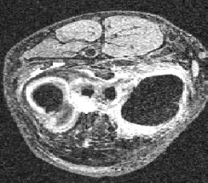
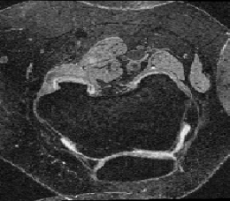
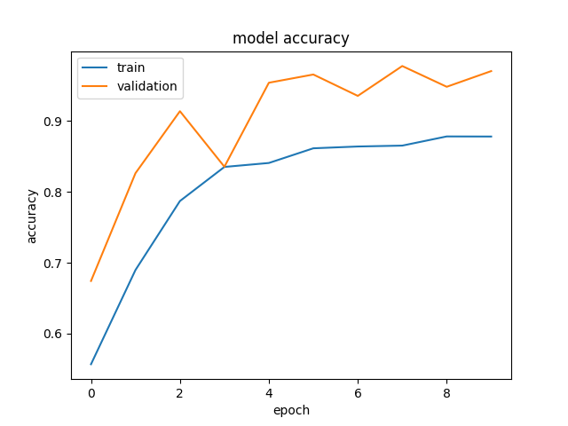
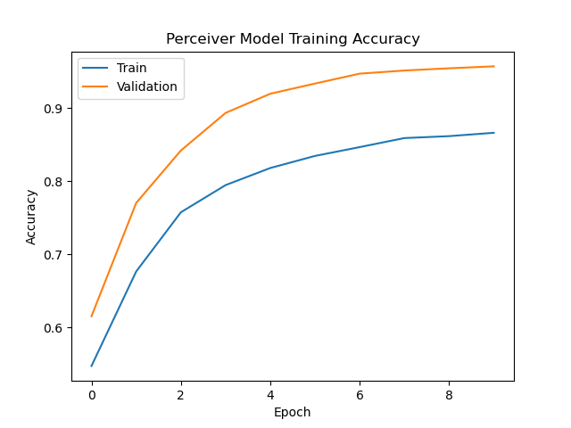
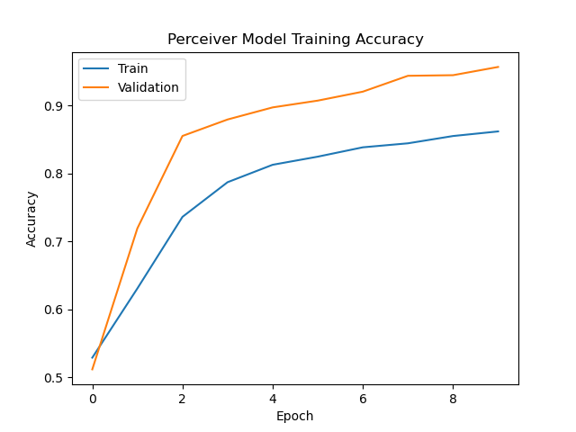

# AKOA Knee Laterality Classification with Perceiver Transformer

Perceiver Transformer Architecture:
-
The Perceiver Transformer is a type of transformer network which repeatedly encodes patched image data
into a fixed size latent array through a cross-attention module which is then processed by a number of
self-attention layers in a transformer module. These two key components can be repeated a number of times,
with skip connections between repeats. The key advantage of the perceiver transformer over traditional
transformers is the cross-attention module, which projects the high-dimensional image input data into a 
fixed dimensional latent array, which occurs in O(nm) time where n is the size of the image byte array and
m is the size of the latent array. This scales much better than the traditional transformer, which instead
uses self-attention layers which scale quadratically with the input size as O(n^2). This helps reduce the 
dimensionality of the model and thus allow it to process larger more complex datasets with greater model
depth. 

The Osteoarthritis Initiative Accelerated Knee Osteroarthritis (OAI AKOA) dataset contains 
~19000 MRI images of patients left and right knees with and without osteoarthritis. Building classifiers
on such a dataset is important in the field of medical research as the onset of this disease is 
poorly understood. This study aims to build and train a perceiver transformer to determine knee
laterality (left or right) of images in the AKOA dataset.

*Left*

         

*Right*

The Perceiver model constructed in the current report has the following structure:

1. 2 iterations of:
   - Cross-attention module
      - cross-attention layer with, 2 skip connections and dense layers
   - Transformer module
      - 4 self-attention blocks, each with 2 skip connections and dense layers
2. Global average layer
3. Classification layer (latent array size * num_classes)

Loss: BinaryCrossEntropy (from logits)

Optimizer: Layer-wise Adaptive Moments optimizer for batch training (LAMB)
   - lr (learning rate) = 0.001
   - wd (weight decay) = 0.0001

Hyperparameters:
- Latent Array Size: 32
- Dense layer dropout: 0.2
- Image patching size: 2
- Image size: 16 * 16
- Image Data Array Size: (16 // 2) ** 2 

Training:
-

The images in the AKOA dataset are of size 260 x 228, which are downsampled to 16 x 16
for the training and validation of the model, with grayscale normalisation (1./127.5 - 127.5). 
This allowed fast training performance as well as strong inference due to the reduction of
overfitting observed in longer training experiments (50 epochs) with larger image sizes.
Since the classification problem is relatively simple, detecting whether the image is of a 
left or right knee, it is very prone to overfitting, hence why this highly downsampled training set
likely performs well. The input data is split into 75:25 training/test, with a large portion
of test data chosen to again reduce overfitting in the training data and give an accurate
representation of performance upon model evaluation. The training data was split into 80:20 
training and validation, which was chosen as a fairly routine split ratio for machine learning
experiments. Overall this training procedure produced excellent results, as observed in the results below.

*E.g. training images resized to 16 * 16:*

Results
-

With a latent size of 128, we observe in the given images of test accuracy and the training and 
validation plot below it that the training was highly convergent in a matter of 10 epochs to above the 90% threshold, 
with a high test set accuracy of 97.16%.

*LATENT ARRAY SIZE = 128*

Interestingly, initial results were strong with a latent array size of 128, but with subsequent
reductions of latent array size to 32 and then 16 also yielded very strong results.
It appears that the smoothness and convergence of the training curve is optimised
by the latent array size of 32, as is observed in the plot. This is reflective of the power of
the perceiver transformer, with even small latent array encodings able to produce strong inference,
with low required computing power.

*LATENT ARRAY SIZE = 32*

*LATENT ARRAY SIZE = 16*

Requirements:
- 
- Tensorflow version >= 2.4.1
- tensorflow-addons
- tensorflow-datasets
- scikit-learn
- matplotlib
- numpy

Instructions:
-
1. Place labelled AKOA dataset in the project directory.
2. Create conda environment and install requirements:
   - conda create -n <ENV_NAME> tensorflow-gpu
   - pip install requirements
    
3. Run: driver.py <NAME_OF_AKOA_DATASET_DIRECTORY>
    - on the first run this will sort images into the 'datasets' directory
    - this will default to 'AKOA_Analysis' if nothing is specified

References:
-
*Perceiver paper:*

A. Jaegle, F. Gimeno, A. Brock, A. Zisserman, O. Vinyals, and J. Carreira, “Perceiver: General Perception
with Iterative Attention,” arXiv:2103.03206 [cs, eess], Jun. 2021, arXiv: 2103.03206. [Online]. Available:
http://arxiv.org/abs/2103.03206

*Model based on:*

Salama, K. Keras documentation: Image classification with Perceiver. Keras.io, April 2021. [Online].  
Available: <https://keras.io/examples/vision/perceiver_image_classification/> [Accessed 20 October 2021].