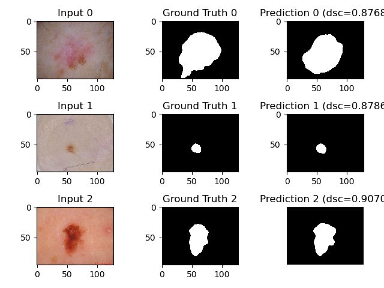

# Segmentation of ISICs Data With Improved U-Net

The ISIC challenge is an annual challenge in which participants attempt to
use computer vision to solve problems related to melanoma diagnosis. In the
2018 challenge, task 1 requires participants to segment images of skin lesions,
into background (not a skin lesion) and foreground (skin lesion). Here, we
use the "[Improved U-Net](https://arxiv.org/abs/1802.10508v1)" model, a
convolutional neural network for segmenting images.
This model, whose layers are connected in a way that resembles a "U"
shape, takes input images and segments them into background and foreground,
as required by the task.

The model has two main paths: a contraction path and an expansion path. In the
contraction path, we descend the "U". Each "level" down, the spatial dimensions
of the image decrease, while the number of features increases. In the expansion
path, we ascend the "U". Each "level" up, the spatial dimensions of the image
increase while the number of features decreases. In addition, the U-Net also
contains "skip connections", which connect layers on the same "level". These
connect the layers on one side of the "U" to the same "level" on the other side
of the "U". Finally, a distinct feature of the "Improved U-Net" is that instead
of performing a single segmentation at the end, we also perform additional
segmentations on the lower levels of the network. The segmentations are then
added with each other to create the final output.

Task 1 of ISIC 2018 provides sets of 2594 training images and ground truth
masks, 100 validation images and ground truth masks, and 1000 test images and
ground truth masks. However, when a challenge is active, the International Skin
Imaging Collaboration (ISIC) withholds ground truth masks for the test set.
At the time of writing, the test ground truth masks are unavailable. Hence,
we reserve 300 images from the original test set as validation, and use the
original validation set as a test set. We choose to use 300 validation images
as this is 11.5% of the training set, which should be a good split to prevent
overfitting.

## Dependencies
The main dependencies required to run the driver are:
- TensorFlow: The machine learning library that powers the model
- Matplotlib: For visualising results

## Results

Here is an example output from running the driver script. This plot
shows rows, each containing an input, ground truth, and prediction.
Observe that all DSC values are above 0.8.

On average, we can expect to achieve an average Dice coefficient of
about 0.86, but some extreme outliers below 0.8 are often recorded.