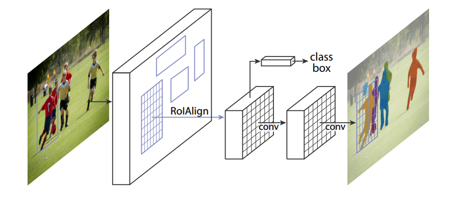
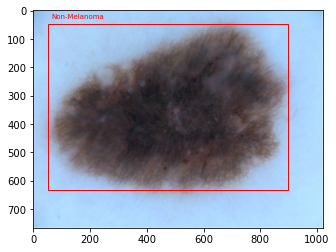

# Detect and classify lesions in the ISIC 2017 dataset using Mask-RCNN
We train a [Mask R-CNN model](https://arxiv.org/abs/1703.06870) on the [ISIC 2017 dataset](https://challenge.isic-archive.com/data/#2017) to detect skin lesions in an image and classify them as cancerous or benign. We start with a model pretrained on the COCO dataset provided by PyTorch (see [here](https://pytorch.org/vision/main/models/mask_rcnn.html)) and train it on the ISIC 2017 dataset. The model is a Mask R-CNN with a ResNet-50-FPN backbone, which is known to be capable of efficiently detecting and classifiying objects in images.

## Mask R-CNN

The Mask R-CNN architecture extends the Faster R-CNN, which outputs a class label and bounding box for an input image. Faster R-CNN first proposes candidate bounding boxes using a Region Proposal Network (RPN) then performs bounding box regression and classification using RoIPool. The Mask R-CNN model follows the same architecture as Faster R-CNN, and further generates a mask in parallel with classification and bounding box regression.

Figure 1: Picture of the Mask R-CNN from the original paper [1]

Therefore, the loss of Mask R-CNN is the sum of the classification loss, the box regression loss, and the mask loss.

## ISIC 2017 Challenge

### Example Input

Figure 2: Example of input image with bounding box and classification

Figure 3: Example of target mask

## Training

## Requirements

* `python==3.9.12`
* `pytorch==1.12.1`
* `torchvision==0.13.1`
* `cudatoolkit==11.3.1`
* `matplotlib==3.5.2`
* `numpy==1.23.1`
* `pandas==1.4.4`
* `pillow==9.2.0`
* `tqdm==4.63.0`

## References
[1] He, Kaiming, Georgia Gkioxari, Piotr Dollár, and Ross Girshick, “Mask R-CNN,” in 2017 IEEE International Conference on Computer Vision (ICCV), October 2017, pp. 2980–2988. [Online] Available: http://arxiv.org/abs/1703.06870.

[2] Codella N, Gutman D, Celebi ME, Helba B, Marchetti MA, Dusza S, Kalloo A, Liopyris K, Mishra N, Kittler H, Halpern A. "Skin Lesion Analysis Toward Melanoma Detection: A Challenge at the 2017 International Symposium on Biomedical Imaging (ISBI), Hosted by the International Skin Imaging Collaboration (ISIC)". arXiv: 1710.05006 [cs.CV]
