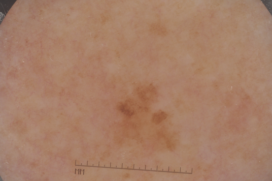
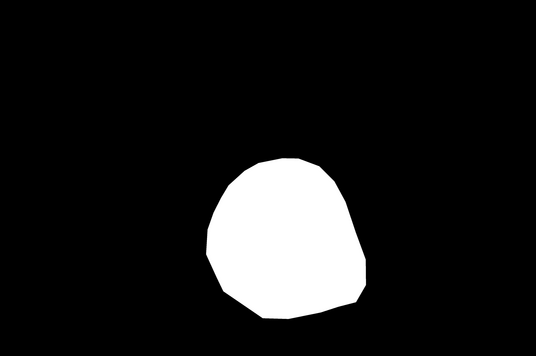

# Image Segmentation for ISIC 2018 Melanoma Dataset
The goal of this project is to perform Image Segmentation on the ISIC (International Skin Imaging Collaboration) 2018 Melanoma Dataset. Melanoma, a form of skin cancer is a public health problem with extremely high mortality. To reduce this, Melanoma needs to be detected early. In this project, this is done using an Improved UNET Model based on the paper [1]. The model will be trained on the dataset to produce a mask for each image containing a skin lesion. Performance wise, the model should achieve a Dice Coefficient for each class (Background and Lesion) greater than 0.8. 

## ISIC 2018 Melanoma Dataset
***
The ISIC 2018 Melanoma Dataset is a large dataset containing a total of 2,594 images of skin lesions and their respective labels. For this project, a preprocessed variant of the dataset was used. This was obtained from Course Help / Resources under COMP3710 Pattern Recognition, Semester 2, 2021.

The images containing the skin lesions are RGB Images, and the respective masks are binary images with the black color representing the background, and the white background representing the masked skin lesion. A random image was chosen from the dataset to be displayed below.

*Figure 1: Image of a Skin Lesion*

*Figure 2: Mask for the Skin Lesion*

## Data Preprocessing
***
For data preprocessing, the directories containing the images and the masks are converted into a 4D numpy array. The arrays will have 4 dimensions, with each dimension corresponding to \[Number of Images, Width, Height, Number of Channels]
The images have a shape of \[2594, 128, 96, 3] and the masks have a shape of \[2594, 128, 96, 1].

Each of these arrays are divided using train_test_split to create a training set of size 0.7, validation set of 0.15, and test set of 0.15.

The masks go through another step to convert all values for each pixel into either one of 2 values; 0 (Black) or 255 (White). The values are then encoded using a LabelEncoder to 0 or 1. Finally, the function to_categorical is used to change the number of channels of the masks from 1 to 2.

## Improved UNET Architecture
***

## Results and Discussion
***

## Hyperparameter Tuning
***

## Dependencies
***
- Tensorflow
- Keras
- Operating System (os)
- Glob
- OpenCV (cv2)
- Numpy
- Matplotlib
- Sklearn
- ISIC 2018 Melanoma Dataset, Retrieved from https://challenge2018.isic-archive.com/

## References
***
[1] F. Isensee, P. Kickingereder, W. Wick, M. Bendszus, and K. H. Maier-Hein, “Brain Tumor Segmentation and Radiomics Survival Prediction: Contribution to the BRATS 2017 Challenge,” Feb. 2018. Retrieved from: https://arxiv.org/pdf/1802.10508v1.pdf