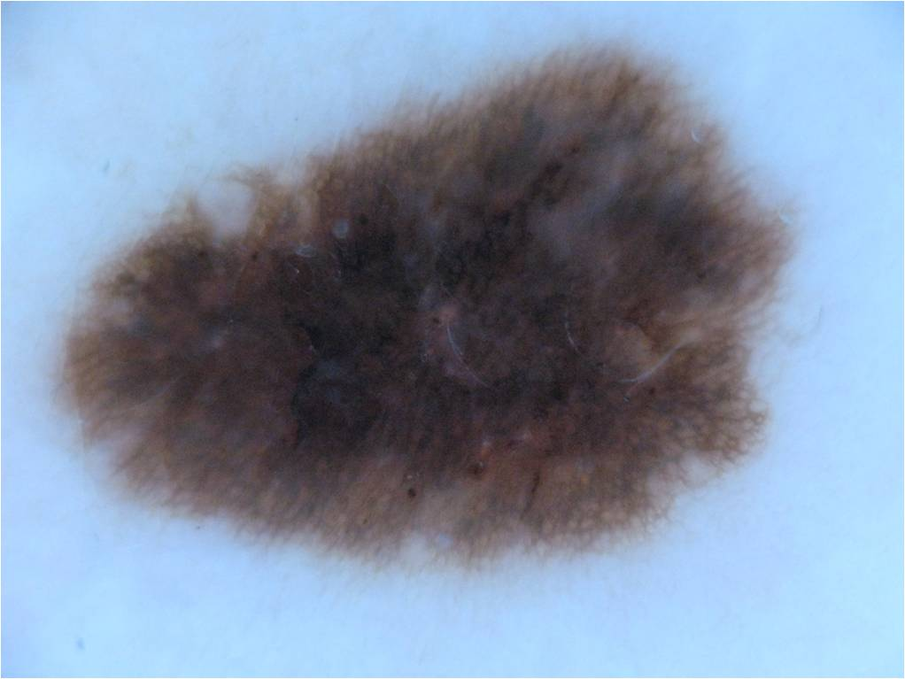

# U-Net Segmentation of ISIC 2017
This repository contains functionality to segment the [ISIC 2017 Lesion Dataset](https://challenge.isic-archive.com/data/#2017) using the [Improved UNet Model](https://arxiv.org/abs/1802.10508v1).

## Dependencies
This model was created/tested using the following software versions:

Python 3.7.15

Pytorch 1.12.1

CUDA 11.3

Pillow 7.1.2

matplotlib 3.2.2

## Functionality
### Modules
[modules.py](modules.py) implements the Improved UNet architecture as faithfully to the [original paper](https://arxiv.org/abs/1802.10508v1) as possible.

It also includes a simple calculator for the DICE loss coefficient for use in training and testing

### Dataset
[dataset.py](dataset.py) Contains functionality for important png and jpg images from a folder directory into Tensors for operation.

Images should be lesions and segmentations should be one-hot masks.

### Training
[train.py](train.py) Trains the model over the dataset specified.

### Prediction
[predict.py](predict.py) Uses the model to make a segmentation of a given image.

## Results
Data was split into sections Training, Testing and Validation as provided by the [ISIC 2017 Lesion Dataset](https://challenge.isic-archive.com/data/#2017).

I was unable to complete the functionality. [modules.py](modules.py) is a complete representation of UNet and [dataset.py](dataset.py) can load images for training, however [train.py](train.py) has no validation and due to file-handling errors I did not have the opportunity to train the network and produce an output.

## Other
Original commit log:

