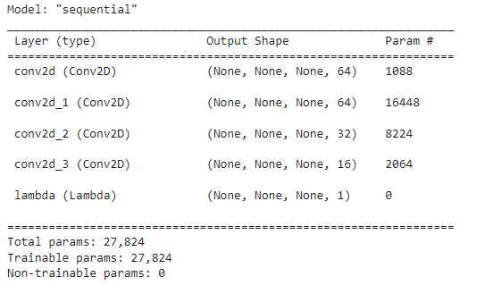
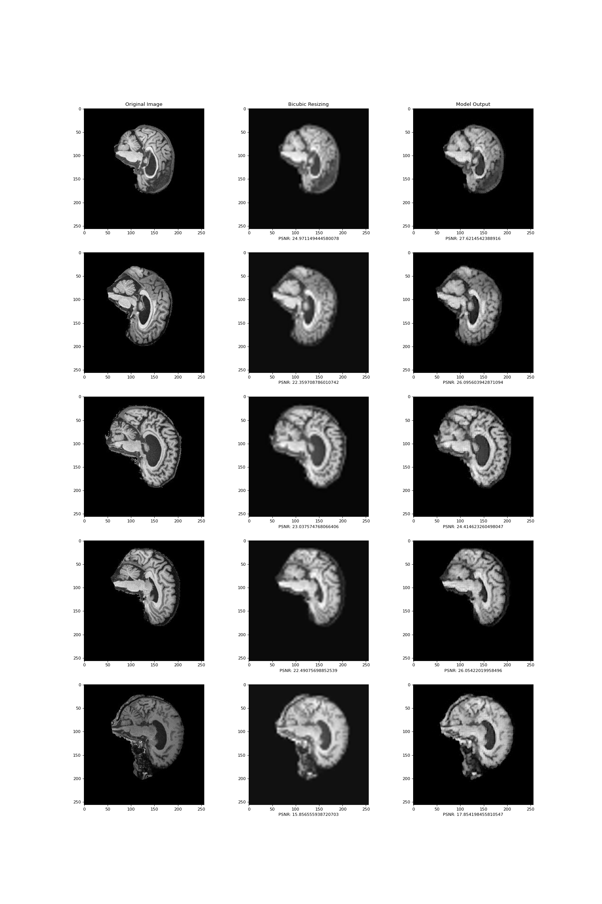

# Brain MRI Super-Resolution Network - 46464383
This algorithm leverages an Efficient Sub-Pixel CNN (ESPCN) to upsample an image when given a low resolution version. These techniques have applications in HDTV, medical imaging, satellite imaging as well as in face recognition and surveillance [2]. In this report, I am focusing on medical imaging. My algorithm upsamples MRI brain scans to prodice a higher resolution image. By increasing the resolution, a clearer picture can be extracted, allowing medical practitioners to view and analyse the output with more clarity. Generally, a high resolution is required to facilitate accurate and early diagnosis [3]. This can be hindered by short time frames and patients' motion during the scan which may result in blurry images [3].

The basic model structure was taken from Reference 1. The model consists of 3 Cond2D layers (convolutional) which apply an increasing number of kernels (filters) to the input image, this produces a set of feature maps to extrace the important features of the image. The final stage in the model is an efficient sub-pixel convolutional layer which actually upscales the image to the intended size (x4). In practice, this is comprised of a Conv2D layer and a tensorflow function to change the image dimensions. The ESPCN is more effective than other models in the super-resolution space as it performs the upscalling as the last layer, this means that the model is aiming to learn from the input image rather than learn how to undo the blur in an already upscaled image.

Image sourced from [2]

## Dependencies
- Tensorflow 2.9.2
- Keras 2.9.0
- Matplotlib 3.2.2
- PIL 7.1.2
- Numpy 1.21.6

math and os libraries are also used (Python 3.7.15)

The code run with these libraries should produce similar results to those presented in this report. However, due to the nature of a neural network, there will be variations in exact training and testing scores.
## Usage
3. provide example inputs, outputs and plots of your algorithm
### Inputs
The input into the model is a 64x64x1 image of an MRI.
### Outputs

## Preprocessing
5. Describe any specific pre-processing you have used with references if any. Justify your training, validation
and testing splits of the data

## References
[1] https://keras.io/examples/vision/super_resolution_sub_pixel/#run-model-prediction-and-plot-the-results
[2] https://arxiv.org/pdf/1609.05158.pdf
[3] https://onlinelibrary.wiley.com/doi/epdf/10.1002/cmr.a.21249
[4] https://medium.com/@zhuocen93/an-overview-of-espcn-an-efficient-sub-pixel-convolutional-neural-network-b76d0a6c875e
