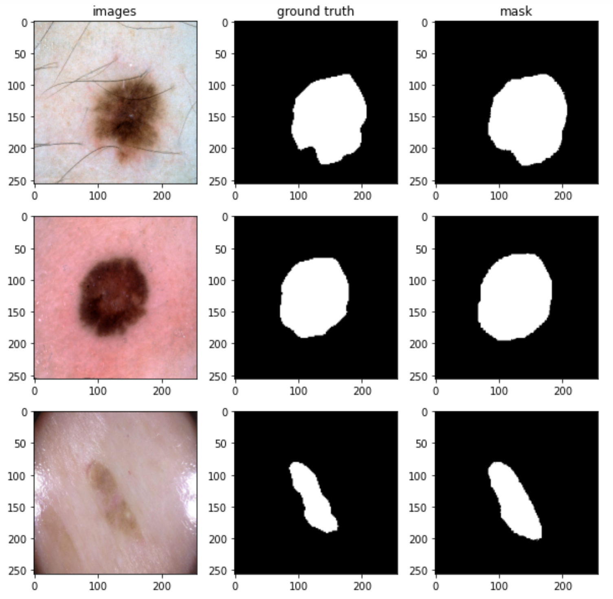

## Improved UNet 

#### Introduction

For this work,I built an improved UNet model and performed image segmentation on the ISICs dataset, which is an image 
of skin cancer. Next, I will introduce the structure of the model, the training process and training results of the model,
and finally I will show the predicted images to compare with the ground truth.

#### Dataset

ISIC 2018 challenge data for skin cancer - This is part of the ISIC 2018 challenge and comes with segmentation labels. 

#### Model architecture

I divided the data set into training set, validation set and test set, the ratio of which is 6:2:2 respectively.
   At the same time, normalize and adjust the image to 256 * 256 * 1 and 256 * 256 * 3.
   To mask the image, I round all the values of the image to 0 and 1. The structure of the improved UNet is shown below.

The improved UNet is roughly divided into two parts: encoding and decoding, like ordinary UNet. The difference is that each
The decoder part of the improved UNet contains a convolutional layer and a context module,
The next level is the sum of the previous level. The context module is also called pre-activation residual and contains 7 layers
These are two instance normalization layers, two activation layers "LeakyReLU", with a negative slope of $10^{-2}$,
2 convolutional layers and a dropout layer with 0.3 dropout. However, the up-sampling module of the decoding part
Replace the previous transposed convolutional layer. The newly added positioning module consists of 3x3 convolution
Convolution with 1x1, it can combine features from concatenation or reduce the number of features.
The model also contains segmentation layers, namely 1 * 1 2D convolutional layer and upsampling2D upscale layer
Floor. The output layer is a 1 * 1 2D convolutional layer, and the activation function is sigmoid.

#### Run model

I used a network architecture with 256*256 voxels and a batch size of 16 for random sampling patch training. A total of 
10 epochs were trained here. Subsequently, I used the Adam optimizer for training, and got an initial learning rate of 
$10^{-4}$. Then I made a prediction on the test set, and I got the result shown below.

#### Evaluation 

Finally, use the trends of loss and accuracy to judge whether the model has converged. Model accuracy and loss graph
As follows. Obviously, the accuracy rate becomes higher and the loss becomes lower.

Upon request, I use the dice coefficient as a model metric for evaluating image segmentation, and use it to get the 
ratio of the same pixels between the live and predicted im

####
[1] Isensee, Fabian, Philipp Kickingereder, Wolfgang Wick, Martin Bendszus, and Klaus H. Maier-Hein. “Brain Tumor Segmentation and Radiomics Survival Prediction: Contribution to the Brats 2017 Challenge.” Brainlesion: Glioma, Multiple Sclerosis, Stroke and Traumatic Brain Injuries, 2018, 287–97. https://doi.org/10.1007/978-3-319-75238-9_25. 

[2] Ronneberger, O., Fischer, P., &amp; Brox, T. (2015). U-Net: Convolutional Networks for Biomedical Image Segmentation. Lecture Notes in Computer Science, 234–241. https://doi.org/10.1007/978-3-319-24574-4_28

[3] Noel Codella, Veronica Rotemberg, Philipp Tschandl, M. Emre Celebi, Stephen Dusza, David Gutman, Brian Helba, Aadi Kalloo, Konstantinos Liopyris, Michael Marchetti, Harald Kittler, Allan Halpern: “Skin Lesion Analysis Toward Melanoma Detection 2018: A Challenge Hosted by the International Skin Imaging Collaboration (ISIC)”, 2018; https://arxiv.org/abs/1902.03368
