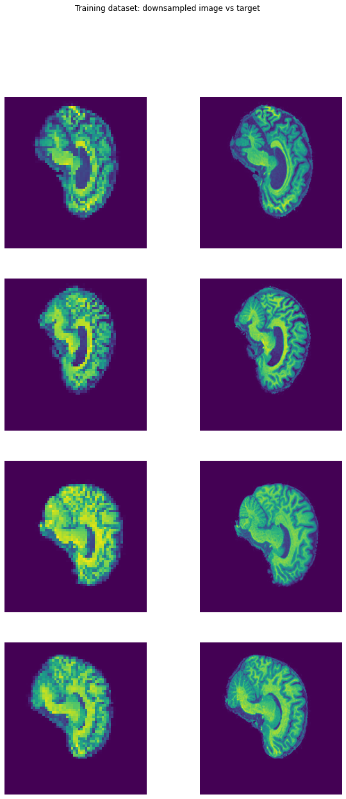

# Super Resolution CNN

_Author_: Sam Lucena | 46416001

COMP3710, The University of Queensland, October 2022

## Algorithm Description
This algorithm is a super-resolution convolutional neural network. It takes as 
input a downscaled or small image and produces an upscaled image. 

This differs from prior algorithms as earlier super-sampling algorithms by 
taking as input a low-resolution image instead of inputting an image that has 
been reshaped to the final resolution. This allows for greater performance and 
speed.

### Problem That it Solves
Super-resolution imaging has applications in many areas of imaging, including 
medical imaging and facial recognition [^1]. The proposed algorithm is used to 
upscale MRI images, which could have benefits in medical fields to lower the 
required resolution of MRI scans, allowing for more patients to access MRI 
scans.

### How it Works
Figure 1 outlines the structure of the algorithm/model used. My implementation 
added an extra convolutional layer to improve output quality.

_Figure 1_: Map of the SPCNN [^1]

The algorithm deconstructs the low-res input to a feature map (convolutional 
layer) and uses this feature map to reconstruct the image into a larger 
resolution. 

The training and test images are downscaled to 1/4 of their original resolution 
using a gaussian filter. These datasets are input to the model for training, 
with the target of each image being the same image in its original resolution. 
The model will then output an image that has been resized back to the original 
resolution.

## Example Usage
### Dependencies
This model was created using:
- python 3.10
- tensorflow 2.9.1
- matplotlib 3.5.3

There should not be any issue reproducing the results and there is no 
functionality that requires specific versions of the above requirements. 

Final testing was done over 200 epochs which took about 75 minutes on a RTX 
3060 graphics card.

### Inputs
The image datasets used for training and testing are retrieved from blackboard 
and downloaded locally [^2]. Figures 2 and 3 give examples from these datasets:

_Figure 2_: Training dataset (downscaled vs original)

_Figure 3_: Testing dataset (downscaled vs original)

### Training the model
To train the model, `run_model()` in `train.py` must be executed. The only 
input to this function is the number of epochs to train for.

While training, the model will save checkpoints every epoch which can be 
further trained using `train_model()`, however this function requires the 
databases to be input. See `run_model()` on how to retrieve databases.

## Data
### Preprocessing
The training and testing datasets have been pre-processed by the course 
teaching team to allow for easy data loading. 

### Data splits
The data given from the course is pre-split into training and testing. I kept 
these provided splits, using the training data as validation during each epoch. 

I didn't create a validation set because it is not so easy to perform 
validation with the super-resolution model and the outputs for loss, psnr 
already give a good idea of the performance of the model. 

## Results
To track the accuracy of the model, PSNR is used to compare the output image 
against the high resolution image. Figure 4 shows that over 200 epochs of 
training, the psnr comparison rose to a steady value just below 28.8. 

_Figure 4_: PSNR performance

As shown in Figure 5, the loss of the model also steadily decreased with 
continued training over 200 epochs. 

_Figure 5_: Loss per epoch

Figures 6, 7, and 8 show the results of 200 epochs of training. These images 
are from the testing dataset.

_Figure 6_: Prediction 1

_Figure 7_: Prediction 2

_Figure 8_: Prediction 3

# References

[^1]: W. Shi _et al._, "Real-Time Single Image and Video Super-Resolution Using 
an Efficient Sub-Pixel Convolutional Neural Network," _2016 IEEE Conference on_ 
_Computer Vision and Pattern Recognition (CVPR)_, 2016, pp. 1874-1883, doi: 
10.1109/CVPR.2016.207.

[^2]: https://cloudstor.aarnet.edu.au/plus/s/L6bbssKhUoUdTSI